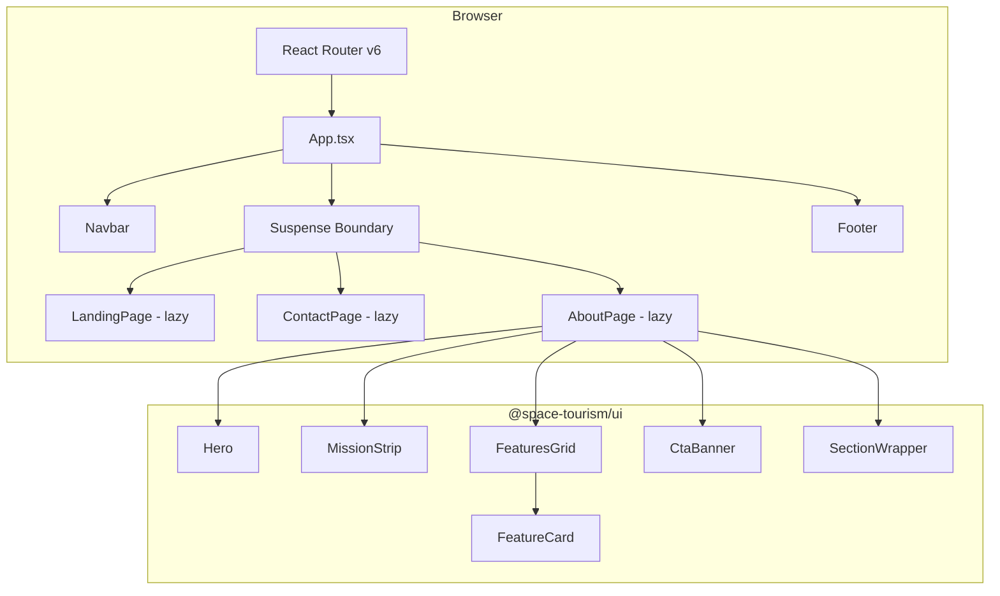
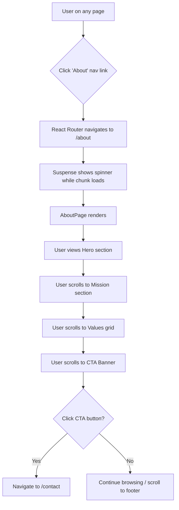
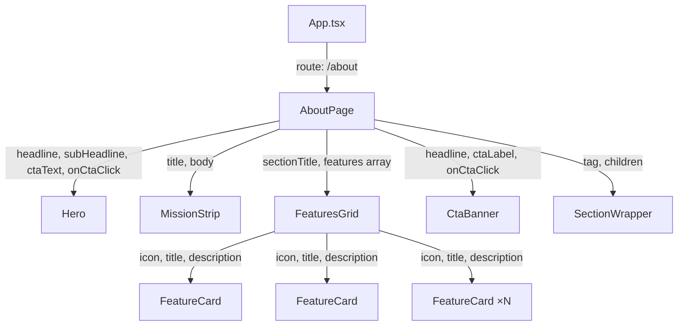
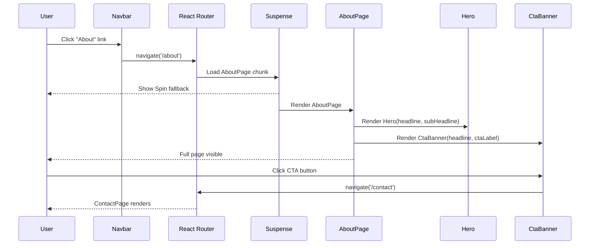

# Feature Specification: About Company Page

## Overview

Add a new static "About" page to the Stellar Horizons space-tourism website at the `/about` route. The page presents the company's story, mission, values, and a call-to-action. The navigation already includes an `/about` link but the route is unregistered, resulting in a dead link.

**Target Users**: Prospective space-tourism customers evaluating Stellar Horizons before booking or contacting the company.

**Business Impact**: Builds trust and credibility by showcasing the company's mission, history, and values. Completes a core informational page already referenced in navigation, eliminating a broken user journey.

**Success Metrics**:
- `/about` route renders without errors and matches existing dark space theme
- "About" nav link shows active state (`aria-current="page"`) when on the page
- Page passes WCAG 2.1 AA accessibility audit
- Lighthouse performance score ≥ 90
- All E2E tests for the About page pass in CI
- Zero horizontal overflow on viewports ≥ 320px

## Requirements Summary

| ID | Requirement | Priority | Complexity | Dependencies |
|----|-------------|----------|------------|--------------|
| R1 | Register `/about` route in App.tsx with lazy loading | P0 | S | None |
| R2 | Hero section with company headline and sub-headline | P0 | S | R1, `Hero` component |
| R3 | Mission & Vision section | P0 | S | R1, `MissionStrip` component |
| R4 | Company Values grid (3–6 cards) | P0 | S | R1, `FeaturesGrid`, `FeatureCard` |
| R5 | CTA Banner navigating to `/contact` | P0 | S | R1, `CtaBanner` component |
| R6 | Mobile-first responsive layout | P0 | S | R2–R5 |
| R7 | Playwright E2E tests | P0 | M | R1–R6 |
| R8 | Company Story / History section | P1 | S | R1, `MissionStrip` or custom |
| R9 | Team / Leadership section | P1 | M | R1 |
| R10 | WCAG 2.1 AA compliance | P0 | S | R2–R6 |

## Architecture Diagrams

### System Architecture



### User Flow



### Component Data Flow



### Component Interaction (Sequence Diagram)



## Architecture Decision Records

### ADR-1: Reuse Existing UI Components Instead of Creating New Ones

- **Status**: Accepted
- **Context**: The About page requires hero, content sections, value cards, and a CTA. The `@space-tourism/ui` package already provides `Hero`, `MissionStrip`, `FeaturesGrid`/`FeatureCard`, `CtaBanner`, and `SectionWrapper` components used by LandingPage.
- **Decision**: Reuse all existing UI components. No new shared components will be created.
- **Alternatives Considered**:
  | Option | Pros | Cons |
  |--------|------|------|
  | Reuse existing components | Zero new UI code, visual consistency, proven accessibility | Content layout constrained to existing component APIs |
  | Create About-specific components | Full design freedom | Unnecessary duplication, maintenance burden |
- **Consequences**: Minimal code addition. Visual consistency guaranteed. If future About page designs diverge significantly from existing component APIs, refactoring may be needed.

### ADR-2: Lazy-Load AboutPage Consistent with Existing Pattern

- **Status**: Accepted
- **Context**: LandingPage and ContactPage are both lazy-loaded via `React.lazy()` with a shared `Suspense` boundary in App.tsx.
- **Decision**: Follow the identical pattern — `const AboutPage = lazy(() => import('./pages/AboutPage'))` in App.tsx.
- **Alternatives Considered**:
  | Option | Pros | Cons |
  |--------|------|------|
  | Lazy load (same pattern) | Consistent, keeps initial bundle small | Extra chunk request on first visit |
  | Eager import | No loading flash | Increases initial bundle for all visitors |
- **Consequences**: About page adds ~0 KB to the initial bundle. First navigation to `/about` incurs a small chunk load (covered by existing Suspense spinner).

### ADR-3: Static Content in a Constants File

- **Status**: Accepted
- **Context**: All About page content is static (no CMS, no API). The LandingPage stores feature card data in `packages/ui/src/constants/featureCards.ts`.
- **Decision**: Define About page content (hero text, mission text, values array, CTA text) in a constants file within `apps/web/src/constants/` to keep the page component clean and content easily editable.
- **Alternatives Considered**:
  | Option | Pros | Cons |
  |--------|------|------|
  | Constants file in apps/web | Clean separation, easy content edits | Extra file |
  | Inline in component | Fewer files | Harder to review/edit content, mixes concerns |
  | Constants in @space-tourism/ui | Shared across apps | About content is app-specific, not shared |
- **Consequences**: Content changes require editing only the constants file. Component stays focused on layout/composition.

### ADR-4: E2E Tests Follow Existing Playwright Patterns

- **Status**: Accepted
- **Context**: Existing E2E tests (`landing.spec.ts`, `contact-form.spec.ts`) use Playwright with custom fixtures from `fixtures.ts` and follow consistent patterns for viewport testing, navigation checks, and accessibility validation.
- **Decision**: New `about.spec.ts` will follow the same fixture setup, test structure, and assertion patterns.
- **Alternatives Considered**:
  | Option | Pros | Cons |
  |--------|------|------|
  | Follow existing patterns | Consistency, team familiarity | None |
  | Different test framework | None for this case | Inconsistency |
- **Consequences**: Tests integrate seamlessly with existing CI pipeline and reporting.

## Component Architecture

### Component Hierarchy

```
App.tsx (existing)
├── Navbar (existing)
├── Suspense (existing)
│   ├── LandingPage (existing, lazy)
│   ├── ContactPage (existing, lazy)
│   └── AboutPage (NEW, lazy)
│       ├── Hero (existing)
│       ├── SectionWrapper (existing)
│       │   └── MissionStrip (existing) — Mission & Vision
│       ├── SectionWrapper (existing)
│       │   └── FeaturesGrid (existing) — Company Values
│       │       └── FeatureCard × 3–6 (existing)
│       ├── SectionWrapper (existing, P1)
│       │   └── CompanyStory — Story/History (reuse MissionStrip or custom)
│       ├── SectionWrapper (existing, P1)
│       │   └── TeamSection — Leadership (new, simple)
│       └── CtaBanner (existing)
└── Footer (existing)
```

### Component Specifications

#### AboutPage

**Purpose**: Page-level container for the About route. Composes existing UI components with static content. Single responsibility: layout and content assembly.

**Location**: `apps/web/src/pages/AboutPage.tsx`

**Props Interface**:
```typescript
// No props — this is a route-level page component
interface AboutPageProps {}
```

**Event Handlers**:
| Event | Handler | Behavior | Side Effects |
|-------|---------|----------|--------------|
| CTA Click | `handleCtaClick` | Navigates to `/contact` | React Router navigation |

**Error Handling**:
| Error Scenario | UI Response | Recovery Action |
|----------------|-------------|-----------------|
| Chunk load failure | Suspense boundary in App.tsx shows fallback | User refreshes or navigates again |
| Unexpected render error | Wrap in Error Boundary (existing App-level) | Fallback UI with retry |

**Accessibility**:
| Requirement | Implementation |
|-------------|----------------|
| Page heading | Single `h1` in Hero component |
| Section headings | `h2` elements for each section title |
| Landmark regions | `<section>` tags via SectionWrapper with `aria-labelledby` |
| CTA keyboard access | Native `<button>` element, focusable, Enter/Space activates |

**Performance**: Use `React.memo` wrapping (consistent with existing page components). No heavy computations — static content only.

#### Hero (existing, no changes)

**Purpose**: Full-viewport-height hero banner with headline, sub-headline, and optional CTA button.

**Location**: `packages/ui/src/components/Hero/Hero.tsx`

**Props Interface** (existing):
```typescript
interface HeroProps {
  headline: string;
  subHeadline: string;
  ctaText?: string;
  onCtaClick?: () => void;
}
```

**Usage on About page**: Render with company tagline as headline, brief company description as sub-headline. No CTA button in hero (CTA is at bottom via CtaBanner), or optionally a "Learn More" scroll CTA.

#### FeaturesGrid (existing, no changes)

**Purpose**: Responsive grid of FeatureCard components with a section title.

**Location**: `packages/ui/src/components/FeaturesGrid/FeaturesGrid.tsx`

**Props Interface** (existing):
```typescript
interface FeaturesGridProps {
  sectionTitle: string;
  features: FeatureCardData[];
}

interface FeatureCardData {
  icon: string;
  title: string;
  description: string;
}
```

**Usage on About page**: Pass company values (3–6 items) as features array with `sectionTitle: "Our Values"`.

#### MissionStrip (existing, no changes)

**Purpose**: Full-width content section with a large heading and body paragraph.

**Location**: `packages/ui/src/components/MissionStrip/MissionStrip.tsx`

**Props Interface** (existing):
```typescript
interface MissionStripProps {
  title: string;
  body: string;
}
```

**Usage on About page**: Display mission/vision statement. Can be reused for Company Story section (P1).

#### CtaBanner (existing, no changes)

**Purpose**: Call-to-action banner with headline text and action button.

**Location**: `packages/ui/src/components/CtaBanner/CtaBanner.tsx`

**Props Interface** (existing):
```typescript
interface CtaBannerProps {
  headline: string;
  ctaLabel: string;
  onCtaClick: () => void;
}
```

**Usage on About page**: `headline: "Ready to Explore?"`, `ctaLabel: "Get in Touch"`, `onCtaClick: navigate('/contact')`.

#### SectionWrapper (existing, no changes)

**Purpose**: Layout container providing consistent max-width (1200px), padding, and semantic HTML tag.

**Location**: `packages/ui/src/components/SectionWrapper/SectionWrapper.tsx`

**Props Interface** (existing):
```typescript
interface SectionWrapperProps {
  tag?: 'section' | 'div' | 'article' | 'aside';
  children: React.ReactNode;
  className?: string;
}
```

## State Management

### State Shape

```typescript
// No new global state. AboutPage is fully static.
// The only relevant state is React Router's location state:

// Existing — no changes
interface AppRouterState {
  pathname: string; // '/about' when on About page
}
```

### State Ownership Matrix

| State | Owner | Reason | Access Pattern |
|-------|-------|--------|----------------|
| Current route (`/about`) | React Router | URL-driven navigation | `useNavigate()`, `useLocation()` |
| Nav active state | Navbar (existing) | Derived from current route via `NavLink` | `aria-current="page"` automatic |
| Page content | Static constants | No dynamic data | Direct import |
| Suspense loading | React Suspense (existing) | Lazy chunk loading | Automatic |

## API Integration

### Endpoints

N/A — This is a fully static page with no API calls.

### Error Handling

N/A — No API integration. No HTTP requests are made by the About page.

## Performance Strategy

### Bundle Impact

| Addition | Est. Size | Justification | Alternative Considered |
|----------|-----------|---------------|------------------------|
| AboutPage component | ~2–3 KB (gzipped) | Core page, lazy-loaded | N/A |
| About content constants | ~1 KB | Static text + value definitions | Inline (rejected per ADR-3) |
| about.spec.ts (E2E) | 0 KB (not bundled) | Test file only | N/A |

**Total impact on initial bundle: 0 KB** (lazy-loaded chunk only fetched when visiting `/about`).

### Render Optimization

| Component | Memoization | Reason |
|-----------|-------------|--------|
| AboutPage | `React.memo` | Consistent with LandingPage/ContactPage pattern |
| Hero | Already `React.memo` | Existing |
| FeaturesGrid | Already `React.memo` | Existing |
| FeatureCard | Already `React.memo` | Existing, renders in list |
| MissionStrip | Already `React.memo` | Existing |
| CtaBanner | Already `React.memo` | Existing |

**Code Splitting**: `AboutPage` is loaded via `React.lazy(() => import('./pages/AboutPage'))` within the existing `<Suspense fallback={<Spin />}>` boundary in App.tsx. No additional splitting needed — all UI components are already in the `@space-tourism/ui` bundle shared across pages.

## Testing Strategy

### Test Matrix

| Component/Function | Unit | Integration | E2E | Notes |
|--------------------|------|-------------|-----|-------|
| AboutPage | Yes | Yes | Yes | Renders all sections, content visible |
| Hero (on About) | - | - | Yes | Verified via page-level E2E |
| Values grid | - | - | Yes | Card count ≥ 3, responsive layout |
| CTA navigation | - | Yes | Yes | Critical path: click → `/contact` |
| Nav active state | - | - | Yes | `aria-current="page"` on About link |
| Mobile responsive | - | - | Yes | No horizontal overflow at 375px |
| Desktop layout | - | - | Yes | Multi-column value cards at 1280px |

**Target**: 20% unit, 20% integration, 60% E2E — E2E-heavy because the page is static presentational content with minimal logic.

### E2E Test Specifications

| Test ID | Description | Viewport | Key Assertions |
|---------|-------------|----------|----------------|
| E2E-1 | About page loads with all sections | Default (1280×720) | Hero headline visible, mission section visible, ≥3 value cards, CTA banner visible, footer visible |
| E2E-2 | Navigation to About from home | Default | Click "About" link → URL is `/about`, `aria-current="page"` present |
| E2E-3 | CTA navigates to Contact | Default | Click CTA button → URL is `/contact` |
| E2E-4 | Mobile responsive | 375×667 | No horizontal overflow (`scrollWidth ≤ clientWidth`), hamburger menu visible |
| E2E-5 | Desktop multi-column values | 1280×720 | Value cards positioned in multiple columns (different Y positions) |

### Unit/Integration Test Specifications

| Test | Type | Key Assertions |
|------|------|----------------|
| AboutPage renders without crashing | Unit | Component mounts, no errors |
| Hero displays headline and sub-headline | Unit | Text content present in DOM |
| Values section renders correct card count | Unit | 3–6 FeatureCard elements rendered |
| CTA button navigates to /contact | Integration | `useNavigate` called with `/contact` on click |

## Security

| Concern | Mitigation | Implementation |
|---------|------------|----------------|
| XSS | No user input on this page | All content is hardcoded static strings |
| CSRF | N/A | No form submissions or API calls |
| Sensitive data exposure | N/A | No sensitive data on this page |
| Dependency vulnerabilities | Standard | Relies on existing vetted dependencies only |
| CSP headers | Existing | No new inline scripts or external resources added |

## Accessibility

- [x] All interactive elements have accessible names (CTA button has visible label text)
- [ ] Dynamic content uses `aria-live` regions — N/A (no dynamic content)
- [x] Headings hierarchy: `h1` (Hero headline) → `h2` (section titles) — no skipped levels
- [x] Sections use semantic `<section>` elements via SectionWrapper
- [x] `aria-labelledby` on sections referencing their heading IDs
- [x] `aria-current="page"` on active nav link (existing Navbar behavior via NavLink)
- [x] CTA button is a native `<button>`, keyboard-operable (Tab, Enter, Space)
- [x] Color contrast meets WCAG AA: `#E8E8E8` on `#0A0A0F` = 15.7:1 ratio (passes)
- [x] No images requiring alt text (icons are decorative via `aria-hidden`)
- [x] Page is navigable without CSS (semantic HTML structure)
- [ ] Focus management: no modals or dynamic content requiring focus trapping on this page

## Implementation Checklist

### Phase 1: Foundation (P0)
- [ ] Create `apps/web/src/constants/aboutContent.ts` with static content (hero, mission, values, CTA text)
- [ ] Define `CompanyValue` and `AboutPageContent` TypeScript interfaces

### Phase 2: Page Component (P0)
- [ ] Create `apps/web/src/pages/AboutPage.tsx` composing Hero, SectionWrapper, MissionStrip, FeaturesGrid, CtaBanner
- [ ] Add CSS module `apps/web/src/pages/AboutPage.module.css` if any page-specific styles needed
- [ ] Register lazy-loaded `/about` route in `apps/web/src/App.tsx`
- [ ] Verify navigation link activates correctly

### Phase 3: Testing (P0)
- [ ] Create `e2e/e2e/about.spec.ts` with E2E tests (E2E-1 through E2E-5)
- [ ] Add unit/integration tests for AboutPage component
- [ ] Run full E2E suite to ensure no regressions

### Phase 4: P1 Enhancements (Deferred)
- [ ] Add Company Story section (reuse MissionStrip or custom layout)
- [ ] Add Team/Leadership section
- [ ] Update E2E tests for new sections

## File Structure

```
apps/web/src/
├── App.tsx                          # MODIFIED: Add lazy AboutPage import + /about route
├── constants/
│   └── aboutContent.ts              # NEW: Static content for About page
├── pages/
│   ├── LandingPage.tsx              # EXISTING (unchanged)
│   ├── ContactPage.tsx              # EXISTING (unchanged)
│   └── AboutPage.tsx                # NEW: About page component

e2e/e2e/
├── about.spec.ts                    # NEW: Playwright E2E tests for About page
├── fixtures.ts                      # EXISTING (unchanged)
├── landing.spec.ts                  # EXISTING (unchanged)
├── contact-form.spec.ts            # EXISTING (unchanged)
├── navigation.spec.ts              # EXISTING (unchanged)
└── mobile-navbar.spec.ts           # EXISTING (unchanged)

packages/ui/src/                     # NO CHANGES to UI package
├── components/
│   ├── Hero/
│   ├── FeaturesGrid/
│   ├── FeatureCard/
│   ├── MissionStrip/
│   ├── CtaBanner/
│   └── SectionWrapper/
├── constants/
├── theme/
└── types.ts
```

## Open Questions

| ID | Question | Owner | Due | Status | Assumed Default |
|----|----------|-------|-----|--------|-----------------|
| Q1 | What specific company values should be displayed? | Content/Product | TBD | Open | Safety, Innovation, Sustainability, Excellence |
| Q2 | Should company story include specific dates/milestones or general narrative? | Content/Product | TBD | Open | General narrative for v1 |
| Q3 | Is team/leadership section needed for v1? | Product | TBD | Open | Deferred to P1 |
| Q4 | Should Hero have a background image or CSS gradient? | Design | TBD | Open | CSS gradient (consistent with existing Hero) |
| Q5 | Is approved copy available or should placeholder content be used? | Content/Product | TBD | Open | Placeholder content for initial implementation |
| Q6 | Should the Hero section include a CTA button (e.g., "Learn More" scroll) or only headline/sub-headline? | Design | TBD | Open | No hero CTA; primary CTA is CtaBanner at bottom |

## Appendix

### Glossary

| Term | Definition |
|------|------------|
| Stellar Horizons | The company brand name for this space-tourism website |
| spaceTheme | Ant Design theme configuration (`spaceTheme.ts`) defining colors, typography, and dark algorithm |
| SectionWrapper | Reusable layout component providing consistent max-width (1200px) and padding for page sections |
| FeaturesGrid | Responsive grid component rendering up to 6 FeatureCard items (3-col desktop, 2-col tablet, 1-col mobile) |
| MissionStrip | Full-width content section component with gradient background, large heading, and body text |
| CtaBanner | Call-to-action banner component with headline and action button |
| Hero | Full-viewport-height hero banner with headline, sub-headline, and optional CTA |

### References

- Existing pages: `apps/web/src/pages/LandingPage.tsx`, `apps/web/src/pages/ContactPage.tsx`
- Navigation config: `packages/ui/src/constants/navLinks.ts`
- App shell: `apps/web/src/App.tsx`
- UI components: `packages/ui/src/components/`
- Theme: `packages/ui/src/theme/spaceTheme.ts`
- E2E fixtures: `e2e/e2e/fixtures.ts`
- Playwright config: `e2e/playwright.config.ts`
- Component types: `packages/ui/src/types.ts`
