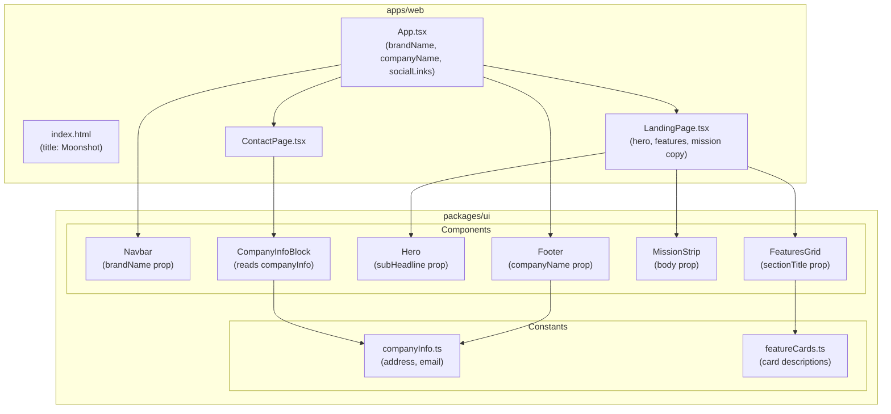
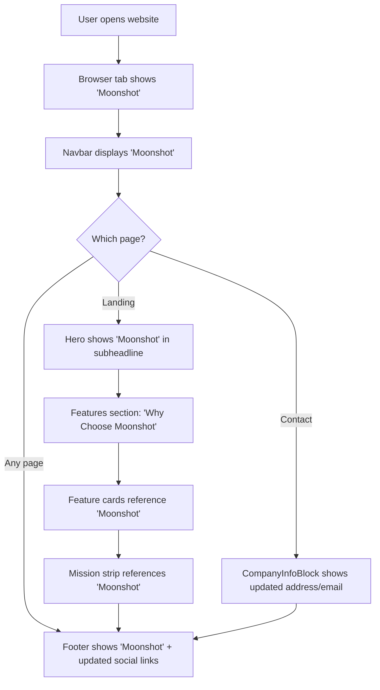
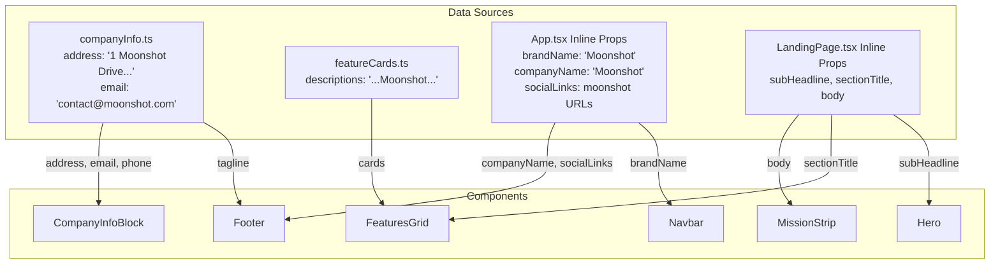
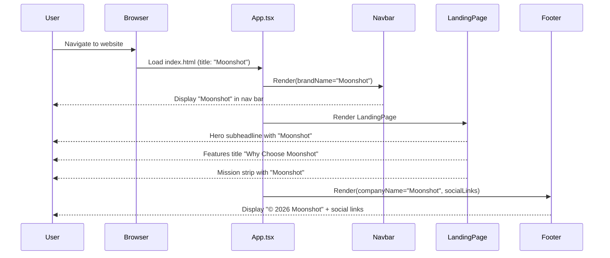

# Feature Specification: Rebrand Company Name from "Stellar Horizons" to "Moonshot"

## Overview

Replace all instances of the company name "Stellar Horizons" with "Moonshot" across the entire space-tourism monorepo, including UI text, HTML metadata, constants, social media URLs, contact information, and test assertions.

**Target Users**: All visitors to the space tourism website; developers maintaining the codebase.

**Business Impact**: Establishes the new "Moonshot" brand identity consistently across the customer-facing website and all supporting code. Eliminates brand confusion by removing all remnants of the old "Stellar Horizons" name.

**Success Metrics**:
- Zero occurrences of "Stellar Horizons" (case-insensitive) in source code, constants, or test files
- All user-visible text displays "Moonshot" instead of "Stellar Horizons"
- HTML `<title>` tag reads "Moonshot"
- All existing unit tests pass with updated brand references
- All existing E2E tests pass with updated brand references
- Social media URLs and contact information reflect the new brand

## Requirements Summary

| ID | Requirement | Priority | Complexity | Dependencies |
|----|-------------|----------|------------|--------------|
| R1 | Replace "Stellar Horizons" with "Moonshot" in all UI-visible text | P0 | S | None |
| R2 | Update `<title>` tag in `index.html` to "Moonshot" | P0 | S | None |
| R3 | Update `companyInfo.ts` address and email | P0 | S | None |
| R4 | Update social media URLs from `stellar-horizons`/`stellarhorizons` to `moonshot` | P1 | S | None |
| R5 | Update feature card marketing copy in `featureCards.ts` | P0 | S | None |
| R6 | Update landing page copy (hero, features title, mission statement) | P0 | S | None |
| R7 | Update all unit and E2E test assertions referencing old brand | P0 | M | R1–R6 |

## Architecture Diagrams

### System Architecture



### User Flow



### Component Data Flow



### Component Interaction (Sequence Diagram)



## Architecture Decision Records

### ADR-1: Direct String Replacement Over Centralized Brand Configuration
- **Status**: Accepted
- **Context**: The rebrand requires changing ~40 occurrences of "Stellar Horizons" across 9 files. We could either (a) do direct find-and-replace in each file, or (b) refactor all brand references into a single centralized config constant and reference it everywhere.
- **Decision**: Direct string replacement in each file, preserving the existing architecture pattern where some values are in constants (`companyInfo.ts`) and others are inline props.
- **Alternatives Considered**:

  | Option | Pros | Cons |
  |--------|------|------|
  | Direct replacement (chosen) | Minimal change footprint; no structural refactoring; lower risk | Future rebrands require same multi-file effort |
  | Centralized brand config | Single source of truth for all brand strings; easier future rebrands | Over-engineering for a one-time change; introduces new module; changes component interfaces; higher risk |

- **Consequences**: Each file retains its current pattern (inline props vs constants). If another rebrand occurs, the same multi-file replacement process would be needed. This is acceptable given YAGNI — the change is simple and low-risk.

### ADR-2: Update Test Assertions Inline Rather Than Extracting Test Fixtures
- **Status**: Accepted
- **Context**: ~29 test assertions reference "Stellar Horizons." We could extract the brand name to a shared test fixture constant, or update each assertion directly.
- **Decision**: Update each test assertion directly to "Moonshot", matching the existing test code patterns.
- **Alternatives Considered**:

  | Option | Pros | Cons |
  |--------|------|------|
  | Direct assertion update (chosen) | Matches existing test patterns; no test infrastructure change | Repeated string in tests |
  | Shared test fixture constant | DRY test code | Over-engineering; tests are clearer with explicit strings; adds indirection |

- **Consequences**: Tests remain explicit and readable. Each test file clearly shows what text is expected.

### ADR-3: Preserve Package Names Unchanged
- **Status**: Accepted
- **Context**: The monorepo uses package names `space-tourism`, `@space-tourism/web`, `@space-tourism/ui`. These could be renamed to align with the "Moonshot" brand.
- **Decision**: Package names remain unchanged per requirements (out of scope).
- **Alternatives Considered**:

  | Option | Pros | Cons |
  |--------|------|------|
  | Keep package names (chosen) | Zero risk to build/CI pipeline; no lockfile changes | Package names don't match brand |
  | Rename packages | Full brand alignment | High risk: breaks imports, CI, lockfiles; out of scope |

- **Consequences**: Internal package identifiers still reference "space-tourism." This is acceptable as package names are developer-facing, not user-facing.

## Component Architecture

### Component Hierarchy

```
App.tsx (Container)
├── Navbar/                        ← brandName="Moonshot"
│   └── (mobile nav drawer)       ← same brandName
├── Routes/
│   ├── LandingPage/
│   │   ├── Hero/                 ← subHeadline contains "Moonshot"
│   │   ├── FeaturesGrid/         ← sectionTitle="Why Choose Moonshot"
│   │   │   └── FeatureCard/      ← descriptions from featureCards.ts
│   │   ├── MissionStrip/         ← body contains "Moonshot"
│   │   └── CtaBanner/
│   └── ContactPage/
│       ├── ContactForm/
│       └── CompanyInfoBlock/     ← reads companyInfo.ts constants
└── Footer/                        ← companyName="Moonshot", socialLinks
```

### Component Specifications

#### Navbar

**Purpose**: Displays the brand name in the site navigation bar (desktop and mobile).

**Location**: `packages/ui/src/components/Navbar/Navbar.tsx`

**Props Interface** (existing — no changes to interface):
```typescript
interface NavbarProps {
  brandName: string;        // Value changes: "Stellar Horizons" → "Moonshot"
  links: NavLink[];
  onContactClick?: () => void;
}
```

**Affected Prop Values**:
| Prop | Old Value | New Value |
|------|-----------|-----------|
| `brandName` | `"Stellar Horizons"` | `"Moonshot"` |

**Event Handlers**: No changes.

**Error Handling**: N/A — presentational component with no error states affected.

**Accessibility**:
| Requirement | Implementation |
|-------------|----------------|
| Brand text accessible | Ensure any `aria-label` referencing "Stellar Horizons" is updated to "Moonshot" |

**Performance**: No changes — React.memo behavior unaffected since prop value is static.

#### Footer

**Purpose**: Displays company name, copyright, tagline, and social media links.

**Location**: `packages/ui/src/components/Footer/Footer.tsx`

**Props Interface** (existing — no changes to interface):
```typescript
interface FooterProps {
  companyName: string;      // Value changes: "Stellar Horizons" → "Moonshot"
  tagline: string;          // No change
  socialLinks: SocialLink[];// URL values change
}
```

**Affected Prop Values**:
| Prop | Old Value | New Value |
|------|-----------|-----------|
| `companyName` | `"Stellar Horizons"` | `"Moonshot"` |
| `socialLinks[0].href` | `https://github.com/stellar-horizons` | `https://github.com/moonshot` |
| `socialLinks[1].href` | `https://twitter.com/stellarhorizons` | `https://twitter.com/moonshot` |
| `socialLinks[2].href` | `https://linkedin.com/company/stellar-horizons` | `https://linkedin.com/company/moonshot` |

**Error Handling**: N/A — presentational component.

**Accessibility**:
| Requirement | Implementation |
|-------------|----------------|
| Social link labels | Verify `aria-label` attributes on social links don't reference old brand |

**Performance**: No changes.

#### Hero

**Purpose**: Displays the hero banner with headline and subheadline on the landing page.

**Location**: `packages/ui/src/components/Hero/Hero.tsx`

**Affected Prop Values**:
| Prop | Old Value | New Value |
|------|-----------|-----------|
| `subHeadline` | `"Stellar Horizons offers exclusive space tourism experiences..."` | `"Moonshot offers exclusive space tourism experiences..."` |

**Error Handling**: N/A.

**Accessibility**: No ARIA changes needed — text content updates automatically.

**Performance**: No changes.

#### FeaturesGrid

**Purpose**: Displays the "Why Choose" section title and a grid of feature cards.

**Location**: `packages/ui/src/components/FeaturesGrid/FeaturesGrid.tsx`

**Affected Prop Values**:
| Prop | Old Value | New Value |
|------|-----------|-----------|
| `sectionTitle` | `"Why Choose Stellar Horizons"` | `"Why Choose Moonshot"` |

**Error Handling**: N/A.

**Accessibility**: No ARIA changes needed.

**Performance**: No changes.

#### MissionStrip

**Purpose**: Displays the company mission statement.

**Location**: `packages/ui/src/components/MissionStrip/MissionStrip.tsx`

**Affected Prop Values**:
| Prop | Old Value | New Value |
|------|-----------|-----------|
| `body` | `"...Stellar Horizons is committed to making space accessible..."` | `"...Moonshot is committed to making space accessible..."` |

**Error Handling**: N/A.

**Accessibility**: No ARIA changes needed.

**Performance**: No changes.

#### CompanyInfoBlock

**Purpose**: Displays company contact information (address, email, phone) sourced from `companyInfo.ts` constants.

**Location**: `packages/ui/src/components/CompanyInfoBlock/CompanyInfoBlock.tsx`

**Data Source Changes** (in `companyInfo.ts`):
| Field | Old Value | New Value |
|-------|-----------|-----------|
| `address` | `"1 Stellar Drive, Cape Canaveral, FL 32920, USA"` | `"1 Moonshot Drive, Cape Canaveral, FL 32920, USA"` |
| `email` | `"contact@stellarhorizons.com"` | `"contact@moonshot.com"` |
| `phone` | `"+1 (800) 867-5309"` | No change |
| `tagline` | `"Where humanity meets the stars..."` | No change |

**Error Handling**: N/A.

**Accessibility**: No ARIA changes needed — `mailto:` link text updates with constant change.

**Performance**: No changes.

## State Management

### State Shape

```typescript
// No state shape changes. This project has no Redux or global state management.
// All affected values are static props passed inline or imported from constants.
// No runtime state transitions are affected by this rebrand.
```

### State Ownership Matrix

| State | Owner | Reason | Access Pattern |
|-------|-------|--------|----------------|
| Brand name ("Moonshot") | Inline prop in `App.tsx` | Static value, not shared state | Direct prop passing |
| Company info (address, email) | `companyInfo.ts` constant | Shared across CompanyInfoBlock and Footer | ES module import |
| Feature card descriptions | `featureCards.ts` constant | Shared by FeaturesGrid | ES module import |
| Landing page copy | Inline props in `LandingPage.tsx` | Page-scoped content | Direct prop passing |
| Social link URLs | Inline array in `App.tsx` | Passed to Footer | Direct prop passing |
| Page title | `index.html` `<title>` tag | Static HTML | Browser reads on load |

## API Integration

### Endpoints

N/A — This is a static site with no backend API. All data is sourced from local constants and inline props.

### Error Handling

N/A — No API calls affected by this change.

## Performance Strategy

### Bundle Impact

| Addition | Size | Justification | Alternative Considered |
|----------|------|---------------|------------------------|
| N/A | 0 KB | No new dependencies, components, or assets | N/A |

This is a pure string replacement change. Bundle size impact is effectively zero (negligible byte differences from shorter/longer string literals).

### Render Optimization

| Component | Memoization | Reason |
|-----------|-------------|--------|
| N/A | No changes | Static prop values changing does not affect memoization strategy |

**Code Splitting**: No changes. No new lazy-loaded components.

## Testing Strategy

### Test Matrix

| Component/File | Unit | Integration | E2E | Notes |
|----------------|------|-------------|-----|-------|
| `Navbar.test.tsx` | Yes (update 15 assertions) | - | - | Replace `brandName="Stellar Horizons"` with `"Moonshot"` |
| `Footer.test.tsx` | Yes (update 11 assertions) | - | - | Replace `companyName` and social URL assertions |
| `CompanyInfoBlock.test.tsx` | Yes (update 2 assertions) | - | - | Replace address and email test fixtures |
| `navigation.test.tsx` | Yes (update 1 assertion) | - | - | Replace `brandName` in test's `AppContent` component |
| Landing page brand display | - | - | Yes | Verify "Moonshot" in navbar, hero, features, footer |
| Contact page brand display | - | - | Yes | Verify address and email show new brand |
| Browser title | - | - | Yes | Verify `document.title === "Moonshot"` |
| Social links | - | - | Yes | Verify social link hrefs contain "moonshot" |

### Existing Test Files Requiring Updates

| Test File | Location | Occurrences | Change Description |
|-----------|----------|-------------|-------------------|
| `Navbar.test.tsx` | `packages/ui/src/components/Navbar/` | 15 | `brandName="Stellar Horizons"` → `"Moonshot"` |
| `Footer.test.tsx` | `packages/ui/src/components/Footer/` | 11 | `companyName="Stellar Horizons"` → `"Moonshot"` + social URLs |
| `CompanyInfoBlock.test.tsx` | `packages/ui/src/components/CompanyInfoBlock/` | 2 | Address + email fixture values |
| `navigation.test.tsx` | `apps/web/src/__tests__/` | 1 | `brandName="Stellar Horizons"` → `"Moonshot"` |

### E2E Test Scenarios (Playwright)

| ID | Scenario | Steps | Expected Result |
|----|----------|-------|-----------------|
| E2E-1 | Landing page brand | Navigate to `/`, check navbar, scroll to footer | "Moonshot" in navbar and footer |
| E2E-2 | Contact page brand | Navigate to `/contact`, check info block | "1 Moonshot Drive" and "contact@moonshot.com" |
| E2E-3 | Browser title | Navigate to `/` | `document.title === "Moonshot"` |
| E2E-4 | Social links | Navigate to `/`, scroll to footer | Social link hrefs contain "moonshot" |
| E2E-5 | Landing page copy | Navigate to `/`, check hero and features | "Moonshot" in subheadline and features title |

**Note**: Existing E2E tests in `e2e/e2e/` (e.g., `landing.spec.ts`, `navigation.spec.ts`) must be checked for assertions referencing "Stellar Horizons" and updated accordingly.

## Security

| Concern | Mitigation | Implementation |
|---------|------------|----------------|
| XSS via brand strings | N/A | All values are static string literals, not user input |
| Social link integrity | Verify URLs point to legitimate accounts | Manual verification of new social media URLs |
| Email address validity | Ensure `contact@moonshot.com` is a valid/configured address or clearly a placeholder | Flagged as open question (Q2) |

No security implications. This change modifies only static string literals — no user input, no API calls, no authentication changes.

## Accessibility

- [x] All interactive elements have accessible names — No changes needed; brand text updates flow through existing accessible markup
- [ ] Verify Navbar `aria-label` attributes reference "Moonshot" if they previously referenced "Stellar Horizons"
- [ ] Verify Footer social links `aria-label` attributes don't reference old brand
- [x] Dynamic content uses `aria-live` regions — N/A, no dynamic content changes
- [x] Form fields have associated labels — N/A, no form changes
- [x] Error states announced to screen readers — N/A
- [x] Focus management — N/A
- [x] Keyboard navigation — N/A

## Implementation Checklist

### Phase 1: Constants & Configuration
- [ ] Update `packages/ui/src/constants/companyInfo.ts`: address → "1 Moonshot Drive...", email → "contact@moonshot.com"
- [ ] Update `packages/ui/src/constants/featureCards.ts`: replace "Stellar Horizons" in feature card descriptions
- [ ] Update `apps/web/index.html`: `<title>` → "Moonshot"

### Phase 2: Component Props & Page Copy
- [ ] Update `apps/web/src/App.tsx`: `brandName`, `companyName` props → "Moonshot"; social link URLs → moonshot equivalents
- [ ] Update `apps/web/src/pages/LandingPage.tsx`: hero `subHeadline`, `sectionTitle`, mission `body` → "Moonshot"

### Phase 3: Test Assertions
- [ ] Update `packages/ui/src/components/Navbar/Navbar.test.tsx` (15 occurrences)
- [ ] Update `packages/ui/src/components/Footer/Footer.test.tsx` (11 occurrences)
- [ ] Update `packages/ui/src/components/CompanyInfoBlock/CompanyInfoBlock.test.tsx` (2 occurrences)
- [ ] Update `apps/web/src/__tests__/navigation.test.tsx` (1 occurrence)
- [ ] Check and update E2E tests in `e2e/e2e/` for any "Stellar Horizons" references

### Phase 4: Verification
- [ ] Run unit tests: `pnpm test` — all pass
- [ ] Run E2E tests: Playwright suite — all pass
- [ ] Run lint: `pnpm lint` — no errors
- [ ] Visual verification: confirm all pages display "Moonshot"
- [ ] Search verification: `grep -ri "stellar" --include="*.ts" --include="*.tsx" --include="*.html"` returns zero matches in source/test files

## File Structure

```
apps/web/
├── index.html                          # Update <title> tag
├── src/
│   ├── App.tsx                         # Update brandName, companyName, socialLinks
│   ├── pages/
│   │   └── LandingPage.tsx             # Update hero, features, mission copy
│   └── __tests__/
│       └── navigation.test.tsx         # Update 1 test assertion

packages/ui/src/
├── constants/
│   ├── companyInfo.ts                  # Update address, email
│   └── featureCards.ts                 # Update feature description
└── components/
    ├── Navbar/
    │   └── Navbar.test.tsx             # Update 15 test assertions
    ├── Footer/
    │   └── Footer.test.tsx             # Update 11 test assertions
    └── CompanyInfoBlock/
        └── CompanyInfoBlock.test.tsx   # Update 2 test assertions

e2e/e2e/
├── landing.spec.ts                     # Check for brand references
├── navigation.spec.ts                  # Check for brand references
├── contact-form.spec.ts               # Check for brand references
└── mobile-navbar.spec.ts              # Check for brand references
```

**Files modified**: 9 source/test files + potential E2E test updates
**Files created**: 0
**Files deleted**: 0

## Open Questions

| ID | Question | Owner | Due | Status |
|----|----------|-------|-----|--------|
| Q1 | Are the social media URLs (GitHub, Twitter, LinkedIn) actual accounts under "moonshot", or placeholders? | Stakeholder | TBD | Open |
| Q2 | Should `contact@moonshot.com` be a real configured email, or is it display-only? | Stakeholder | TBD | Open |
| Q3 | Should the street address remain "1 Moonshot Drive" or change entirely? Assumed: rename "Stellar" → "Moonshot" in address. | Stakeholder | TBD | Open |
| Q4 | Is the intended new name "Moonshot" (one word) or a multi-word variation? Assumed: "Moonshot" per request. | Stakeholder | TBD | Open |
| Q5 | Do any E2E test files assert "Stellar Horizons" text? Need grep verification during implementation. | Engineer | Implementation | Open |

## Appendix

### Glossary

| Term | Definition |
|------|------------|
| Stellar Horizons | The current (old) company brand name being replaced |
| Moonshot | The new company brand name |
| brandName | Prop passed to the Navbar component for displaying the company name |
| companyName | Prop passed to the Footer component for displaying the company name |
| companyInfo.ts | Shared constants file containing address, email, phone, tagline |
| featureCards.ts | Shared constants file containing feature card marketing copy |

### References

- REQUIREMENTS.md (v1.0, 2026-04-08)
- Affected files: `apps/web/src/App.tsx`, `apps/web/src/pages/LandingPage.tsx`, `apps/web/index.html`, `packages/ui/src/constants/companyInfo.ts`, `packages/ui/src/constants/featureCards.ts`, plus 4 test files

### Change Summary

| Category | Files | Total Occurrences |
|----------|-------|-------------------|
| HTML metadata | 1 | 1 |
| App container props | 1 | 5 |
| Page copy | 1 | 3 |
| Shared constants | 2 | 3 |
| Unit tests | 4 | 29 |
| **Total** | **9** | **~41** |
