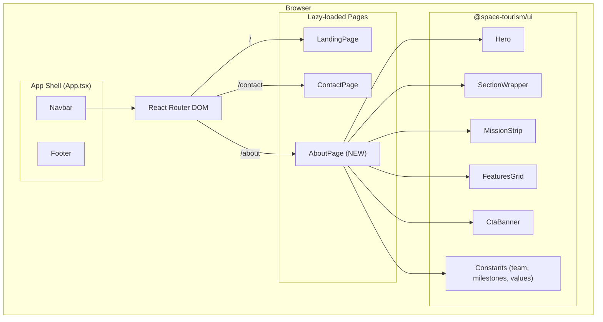
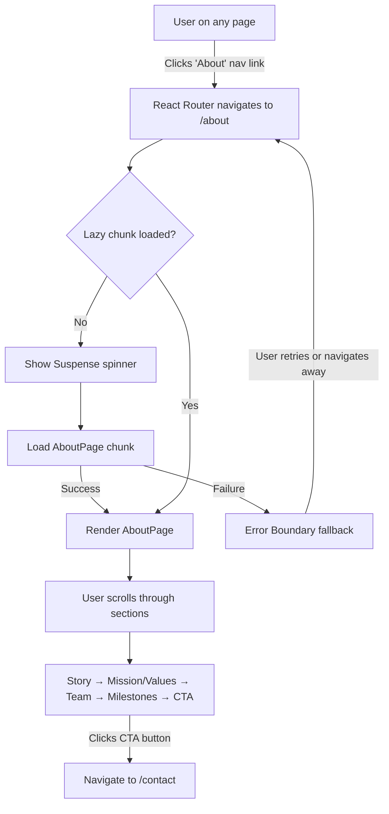
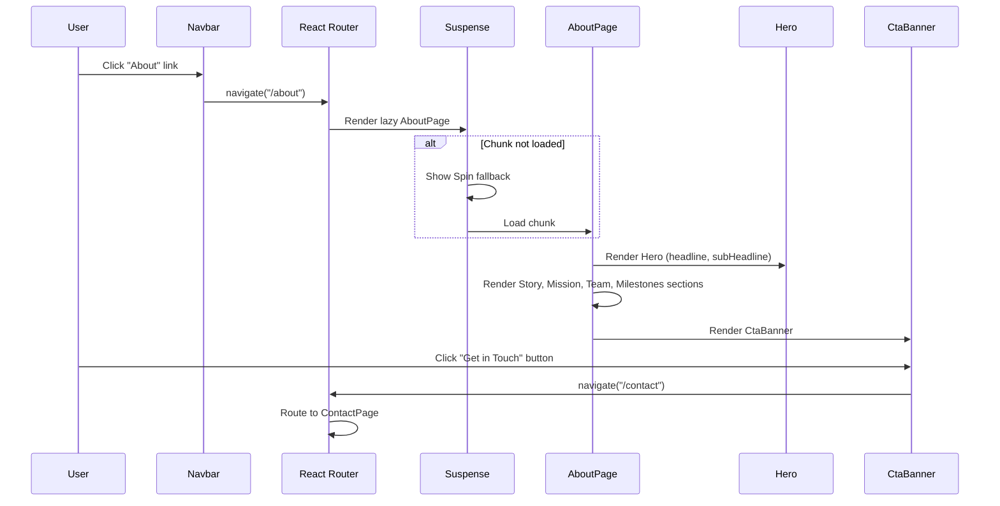

# Feature Specification: About Page for Stellar Horizons

## Overview

Add a static About page at the `/about` route to the Stellar Horizons space tourism website. The page presents the company's story, mission and values, leadership team, and key milestones using existing UI components and design patterns. The `/about` navigation link already exists but currently has no corresponding page implementation.

**Target Users**: Prospective space tourists evaluating Stellar Horizons' credibility, company background, and team expertise before booking a mission.

**Business Impact**: Completes a core informational page referenced in the existing navigation. Builds trust and credibility by showcasing the company's history, mission, team, and track record.

**Success Metrics**:
- About page renders at `/about` without errors
- Navigation "About" link correctly routes and shows active state (`aria-current="page"`)
- Page displays all four content sections (story, mission/values, team, milestones)
- Page follows existing dark theme, CSS Modules, Ant Design design patterns
- Responsive across mobile (320px+) and desktop viewports
- WCAG 2.1 AA compliant
- All unit and E2E tests pass
- About page chunk < 50KB; page load < 2s on 3G

## Requirements Summary

| ID | Requirement | Priority | Complexity | Dependencies |
|----|-------------|----------|------------|--------------|
| R1 | Register `/about` route in App.tsx with lazy loading | P0 | S | None |
| R2 | Company story hero section with headline and narrative | P0 | S | Hero component |
| R3 | Mission statement and 3–4 core values with icons | P0 | M | MissionStrip, FeaturesGrid |
| R4 | Leadership team grid (3–6 members with avatar, name, title, bio) | P0 | M | Ant Design Card, Row, Col |
| R5 | Milestones timeline (4–6 items, chronological) | P1 | M | Ant Design Timeline |
| R6 | CTA banner linking to `/contact` | P1 | S | CtaBanner component |
| R7 | Mobile-first responsive layout (320px–1200px+) | P0 | M | CSS Modules, existing patterns |
| R8 | WCAG 2.1 AA accessibility | P0 | M | SectionWrapper, semantic HTML |
| R9 | Unit tests for AboutPage | P0 | M | Vitest, Testing Library |
| R10 | E2E tests for About page | P1 | M | Playwright |

## Architecture Diagrams

### System Architecture



### User Flow



### Component Data Flow

```mermaid
graph TD
    subgraph App["App.tsx"]
        NavbarC["Navbar (links, currentPath)"]
        Suspense["Suspense (fallback: Spin)"]
        FooterC["Footer"]
    end

    subgraph AboutPage["AboutPage"]
        HeroC["Hero (headline, subHeadline, ctaLabel, onCtaClick)"]
        StorySW["SectionWrapper (Company Story)"]
        StoryText["Typography.Paragraph"]
        MissionSW["SectionWrapper (Mission & Values)"]
        MissionC["MissionStrip (title, body)"]
        ValuesC["FeaturesGrid (features: ABOUT_VALUES)"]
        TeamSW["SectionWrapper (Our Team)"]
        TeamGrid["Row > Col > Card (TEAM_MEMBERS)"]
        MileSW["SectionWrapper (Milestones)"]
        TimelineC["Timeline (MILESTONES)"]
        CtaC["CtaBanner (headline, ctaLabel, onCtaClick)"]
    end

    subgraph Constants["Constants"]
        TM["TEAM_MEMBERS"]
        MS["MILESTONES"]
        AV["ABOUT_VALUES"]
        CI["COMPANY_INFO"]
    end

    Suspense --> AboutPage
    StorySW --> StoryText
    MissionSW --> MissionC
    MissionSW --> ValuesC
    TeamSW --> TeamGrid
    MileSW --> TimelineC
    TM --> TeamGrid
    MS --> TimelineC
    AV --> ValuesC
    CI --> HeroC
```



### Component Interaction (sequence diagram)



## Architecture Decision Records (ADRs)

### ADR-1: Reuse Existing UI Components for About Page Sections

- **Status**: Accepted
- **Context**: The About page has sections (hero, mission, values, CTA) that closely match existing UI components. We need to decide whether to build new components or reuse existing ones.
- **Decision**: Reuse Hero, MissionStrip, FeaturesGrid, CtaBanner, and SectionWrapper from `@space-tourism/ui`. Only create a new TeamCard presentational component for the team member grid, as no existing component matches this need.
- **Alternatives Considered**:
  | Option | Pros | Cons |
  |--------|------|------|
  | Reuse existing components | Consistent UX, less code, faster delivery | May need minor adaptation |
  | Build all new components | Full control over design | Duplicates existing patterns, larger bundle |
- **Consequences**: Faster delivery, consistent design language across pages. Tight coupling to existing component APIs — any breaking change to shared components affects the About page.

### ADR-2: Static Data in Constants Files (No API)

- **Status**: Accepted
- **Context**: Team members, milestones, and values data could be fetched from an API or stored statically.
- **Decision**: Store all About page data as static constants in `packages/ui/src/constants/` files, consistent with how `FEATURE_CARDS`, `COMPANY_INFO`, and `NAV_LINKS` are defined.
- **Alternatives Considered**:
  | Option | Pros | Cons |
  |--------|------|------|
  | Static constants | Zero latency, no API dependency, simple | Requires code change to update content |
  | CMS/API integration | Content editors can update without deploys | Over-engineered for current needs, adds complexity |
- **Consequences**: No network requests, instant content rendering, zero loading states for data. Content updates require a code change and deploy.

### ADR-3: Ant Design Timeline for Milestones

- **Status**: Accepted
- **Context**: Milestones need a chronological visual representation. We need to decide between a custom component or Ant Design's Timeline.
- **Decision**: Use Ant Design's `Timeline` component, which is already in the project's dependency tree, for the milestones section.
- **Alternatives Considered**:
  | Option | Pros | Cons |
  |--------|------|------|
  | Ant Design Timeline | Already bundled, accessible, responsive | Less design control |
  | Custom timeline component | Full design control | More code, more testing, larger bundle |
- **Consequences**: Leverages existing dependency with no additional bundle cost. Timeline styling customized via CSS Modules to match the dark space theme.

### ADR-4: TeamCard as a New Presentational Component in `@space-tourism/ui`

- **Status**: Accepted
- **Context**: There is no existing component for displaying a person card with avatar, name, title, and bio.
- **Decision**: Create a `TeamCard` component in `packages/ui/src/components/TeamCard/` that wraps Ant Design's `Card` component with the required layout. Export it from the UI package for potential reuse.
- **Alternatives Considered**:
  | Option | Pros | Cons |
  |--------|------|------|
  | New TeamCard in UI package | Reusable, testable, follows existing patterns | New component to maintain |
  | Inline JSX in AboutPage | Faster to implement | Not reusable, bloats page component |
- **Consequences**: Clean separation of concerns. Component can be reused if team members appear on other pages in the future.

## Component Architecture

### Component Hierarchy

```
App.tsx
├── Navbar (existing)
├── Suspense (existing, fallback: Spin)
│   └── AboutPage/ (NEW — lazy loaded)
│       ├── Hero (existing — headline, subHeadline, ctaLabel, onCtaClick)
│       ├── SectionWrapper (existing — Company Story)
│       │   └── Typography.Paragraph (Ant Design)
│       ├── SectionWrapper (existing — Mission & Values)
│       │   ├── MissionStrip (existing — mission statement)
│       │   └── FeaturesGrid (existing — core values as feature cards)
│       ├── SectionWrapper (existing — Our Team)
│       │   └── Row > Col (Ant Design responsive grid)
│       │       └── TeamCard (NEW — avatar, name, title, bio)
│       ├── SectionWrapper (existing — Milestones)
│       │   └── Timeline (Ant Design — milestone items)
│       └── CtaBanner (existing — CTA to /contact)
└── Footer (existing)
```

### Component Specifications

#### AboutPage

**Purpose**: Page-level container that composes all About page sections. Lazy-loaded at the `/about` route.

**Location**: `apps/web/src/pages/AboutPage.tsx`

**Props Interface**:
```typescript
// No props — page-level component, receives no external props.
// Uses useNavigate() from react-router-dom for CTA navigation.
```

**Event Handlers**:
| Event | Handler | Behavior | Side Effects |
|-------|---------|----------|--------------|
| CTA Click | `handleCtaClick` | Calls `navigate('/contact')` | Route change |

**Error Handling**:
| Error Scenario | UI Response | Recovery Action |
|----------------|-------------|-----------------|
| Chunk load failure | Error boundary fallback (handled by App.tsx) | User navigates away or refreshes |
| Rendering error | Error boundary fallback | Fallback UI with retry option |

**Accessibility**:
| Requirement | Implementation |
|-------------|----------------|
| Page heading | Single `<h1>` in Hero: "About Stellar Horizons" |
| Section landmarks | Each section wrapped with `SectionWrapper` using `aria-labelledby` |
| Heading hierarchy | h1 (hero) → h2 (section titles) → h3 (card titles) |
| Skip navigation | Handled by existing Navbar component |

**Performance**: Lazy-loaded via `React.lazy()`. No memoization needed — static content, no re-render triggers.

---

#### TeamCard

**Purpose**: Presentational component displaying a team member's avatar, name, title, and short bio in a card format.

**Location**: `packages/ui/src/components/TeamCard/TeamCard.tsx`

**Props Interface**:
```typescript
interface TeamCardProps {
  /** Required: Team member's full name */
  name: string;
  /** Required: Job title / role */
  title: string;
  /** Required: 1-2 sentence biography */
  bio: string;
  /** Optional: URL for avatar image. Falls back to initials placeholder */
  avatarUrl?: string;
  /** Optional: Additional CSS class */
  className?: string;
}
```

**Event Handlers**:
| Event | Handler | Behavior | Side Effects |
|-------|---------|----------|--------------|
| N/A | N/A | Purely presentational, no interactive events | None |

**Error Handling**:
| Error Scenario | UI Response | Recovery Action |
|----------------|-------------|-----------------|
| Missing avatar image | Show initials-based placeholder | Automatic fallback |
| Long name/bio text | CSS text truncation / overflow hidden | Content review |

**Accessibility**:
| Requirement | Implementation |
|-------------|----------------|
| Card semantics | `<article>` element wrapping card content |
| Avatar alt text | `alt="{name}"` on avatar image |
| Heading | `<h3>` for team member name |
| Role context | Name followed by title in `<p>` with distinct styling |

**Performance**: Stateless presentational component. Use `React.memo` since it renders in a list and receives stable props from static constants.

## State Management

### State Shape

```typescript
// No feature-specific state. The About page is entirely static/presentational.
// All data comes from imported constants, not from state management.

// Existing relevant state (unchanged):
interface RouterState {
  location: {
    pathname: string; // "/about" when on About page
  };
}
```

### State Ownership Matrix

| State | Owner | Reason | Access Pattern |
|-------|-------|--------|----------------|
| Current route/path | React Router | Framework-managed routing state | `useLocation()`, `useNavigate()` |
| Team members data | Static constant | No mutations, no server sync | Direct import |
| Milestones data | Static constant | No mutations, no server sync | Direct import |
| Core values data | Static constant | No mutations, no server sync | Direct import |
| Nav active state | Navbar (derived) | Derived from `location.pathname` | Props from App.tsx |
| Mobile menu open | Navbar (local) | UI-only, component-scoped | `useState` in Navbar |

## API Integration

### Endpoints

N/A — The About page is entirely static with no API dependencies. All content is defined in constants files.

### Error Handling

N/A — No network requests. The only error scenario is chunk loading failure, handled by React Suspense and Error Boundaries at the App level.

## Performance Strategy

### Bundle Impact

| Addition | Est. Size | Justification | Alternative Considered |
|----------|-----------|---------------|------------------------|
| AboutPage chunk (lazy) | ~8–15KB | Core page, lazy-loaded | N/A |
| TeamCard component | ~2KB | New presentational component | Inline JSX (not reusable) |
| Constants (team, milestones, values) | ~2KB | Static data files | API fetch (over-engineered) |
| Ant Design Timeline | ~0KB incremental | Already in antd bundle (tree-shaken if unused, but antd is already a dependency) | Custom component (more code) |
| **Total incremental** | **~12–19KB** | Well under 50KB budget | — |

### Render Optimization

| Component | Memoization | Reason |
|-----------|-------------|--------|
| AboutPage | None | Top-level page, renders once |
| TeamCard | `React.memo` | Rendered in list (3–6 items), stable props |
| Hero | None (existing) | Renders once with static props |
| FeaturesGrid | None (existing) | Renders once with static props |

**Code Splitting**: `AboutPage` is loaded via `React.lazy()` with `Suspense` fallback (Ant Design `Spin` component), consistent with LandingPage and ContactPage patterns. The About page chunk is NOT included in the initial bundle.

## Testing Strategy

### Test Matrix

| Component/Function | Unit | Integration | E2E | Notes |
|--------------------|------|-------------|-----|-------|
| AboutPage | Yes | Yes | Yes | Verify all sections render |
| TeamCard | Yes | — | — | Props rendering, avatar fallback |
| Team data constants | Yes | — | — | Validate shape and count |
| Milestones constants | Yes | — | — | Validate chronological order |
| Values constants | Yes | — | — | Validate shape and count |
| Hero CTA click | Yes | Yes | — | Navigate callback |
| CTA Banner → /contact | Yes | Yes | Yes | Critical user path |
| Nav → /about routing | — | Yes | Yes | Active state, URL change |
| Responsive layout | — | — | Yes | Mobile (375px), desktop (1280px) |
| Accessibility (axe) | Yes | — | Yes | jest-axe unit, axe-playwright E2E |

**Target coverage**: 60% unit, 30% integration, 10% E2E.

### Unit Tests (Vitest + Testing Library)

| Test | Description |
|------|-------------|
| Renders without crashing | AboutPage mounts and renders hero heading |
| Hero section | Displays "About Stellar Horizons" headline |
| Company story | Renders narrative paragraph(s) |
| Mission section | Renders MissionStrip with mission text |
| Values section | Renders expected number of value cards (3–4) |
| Team section | Renders expected number of team member cards (4–6) |
| Team card content | Each card shows name, title, and bio |
| Milestones section | Renders expected number of milestones (4–6) |
| Milestones order | Items appear in chronological order |
| CTA banner | Renders with correct label text |
| CTA navigation | `onCtaClick` triggers `navigate('/contact')` |
| Accessibility | No axe violations (jest-axe) |
| TeamCard renders | Displays name, title, bio, avatar |
| TeamCard avatar fallback | Shows placeholder when `avatarUrl` is undefined |

### E2E Tests (Playwright)

| ID | Scenario | Steps | Assertion |
|----|----------|-------|-----------|
| E2E-1 | Navigate to About page | Go to `/`, click "About" nav link | URL is `/about`, heading "About Stellar Horizons" visible |
| E2E-2 | About page content sections | Navigate to `/about` | Story, mission/values, team, milestones sections all visible |
| E2E-3 | CTA navigation | Navigate to `/about`, click CTA button | URL changes to `/contact` |
| E2E-4 | Mobile responsive | Set viewport 375×667, navigate to `/about` | No horizontal scroll, team cards stacked vertically |
| E2E-5 | Accessibility scan | Navigate to `/about`, run axe scan | No critical or serious violations |
| E2E-6 | Nav active state | Navigate to `/about` | "About" link has `aria-current="page"` |

## Security

| Concern | Mitigation | Implementation |
|---------|------------|----------------|
| XSS | No user input on this page | Static content only; no `dangerouslySetInnerHTML` |
| Data exposure | No sensitive data | All content is public marketing copy |
| CSP | Existing CSP headers apply | No new external resources loaded |
| Dependency risk | Uses already-vetted dependencies | No new packages introduced |

## Accessibility

- [x] All interactive elements have accessible names (CTA button via label text)
- [ ] Dynamic content uses `aria-live` regions — N/A (no dynamic content)
- [x] Heading hierarchy: h1 → h2 → h3 maintained across sections
- [x] Sections use `SectionWrapper` with `aria-labelledby` for landmark regions
- [x] Team member avatar images have `alt` text with member's name
- [x] CTA button has visible focus indicator (existing CtaBanner styling)
- [x] Keyboard navigation: Tab through interactive elements (nav links, CTA button)
- [x] Color contrast: text on dark background meets 4.5:1 ratio (existing theme tokens)
- [x] Semantic HTML: `<section>`, `<article>`, `<h1>`–`<h3>` hierarchy
- [x] No auto-playing media or animations that could cause seizures
- [x] Timeline items are accessible as a list structure

## Internationalization

N/A — English only, consistent with all existing pages. All strings are hardcoded. No i18n framework is used in the project.

## Implementation Checklist

### Phase 1: Foundation
- [ ] Define `TeamMember`, `Milestone`, `CoreValue` TypeScript interfaces in `packages/ui/src/types/`
- [ ] Create `packages/ui/src/constants/teamMembers.ts` with 4–6 team member entries
- [ ] Create `packages/ui/src/constants/milestones.ts` with 4–6 milestone entries
- [ ] Create `packages/ui/src/constants/aboutValues.ts` with 3–4 core value entries
- [ ] Export new types and constants from `packages/ui/src/index.ts`

### Phase 2: Components
- [ ] Create `TeamCard` component in `packages/ui/src/components/TeamCard/`
- [ ] Create `TeamCard.module.css` with dark theme styling and responsive layout
- [ ] Add `TeamCard` unit tests
- [ ] Export `TeamCard` from `packages/ui/src/index.ts`

### Phase 3: Page Assembly
- [ ] Create `apps/web/src/pages/AboutPage.tsx` composing all sections
- [ ] Create `apps/web/src/pages/AboutPage.module.css` for page-specific styles
- [ ] Register lazy-loaded `/about` route in `apps/web/src/App.tsx`
- [ ] Add `AboutPage` unit tests in `apps/web/src/pages/AboutPage.test.tsx`

### Phase 4: Integration & Testing
- [ ] Verify navigation active state on `/about`
- [ ] Create `e2e/about.spec.ts` with E2E test scenarios
- [ ] Run accessibility audit (jest-axe + Playwright axe)
- [ ] Verify responsive layout at 320px, 375px, 768px, 1280px viewports
- [ ] Verify bundle chunk size < 50KB
- [ ] Run full test suite (`pnpm test`, `pnpm e2e`)

## File Structure

```
packages/ui/src/
├── components/
│   └── TeamCard/
│       ├── TeamCard.tsx              (NEW)
│       ├── TeamCard.module.css       (NEW)
│       ├── TeamCard.test.tsx         (NEW)
│       └── index.ts                  (NEW)
├── constants/
│   ├── companyInfo.ts                (existing)
│   ├── featureCards.ts               (existing)
│   ├── navLinks.ts                   (existing)
│   ├── teamMembers.ts               (NEW)
│   ├── milestones.ts                 (NEW)
│   └── aboutValues.ts               (NEW)
├── types/
│   └── index.ts                      (MODIFIED — add TeamMember, Milestone, CoreValue)
└── index.ts                          (MODIFIED — export new components, constants, types)

apps/web/src/
├── pages/
│   ├── LandingPage.tsx               (existing)
│   ├── ContactPage.tsx               (existing)
│   ├── AboutPage.tsx                 (NEW)
│   └── AboutPage.module.css          (NEW)
├── App.tsx                           (MODIFIED — add lazy import + route)
└── App.test.tsx                      (MODIFIED — add About route test)

e2e/
├── about.spec.ts                     (NEW)
├── contact-form.spec.ts             (existing)
├── landing.spec.ts                   (existing)
├── mobile-navbar.spec.ts            (existing)
├── navigation.spec.ts               (existing)
├── fixtures.ts                       (existing)
└── playwright.config.ts             (existing)
```

## Open Questions

| ID | Question | Owner | Due | Status |
|----|----------|-------|-----|--------|
| Q1 | What specific team members should be displayed? (Assumed: 4–6 fictional leadership team members with placeholder data) | Product Owner | TBD | Open |
| Q2 | What specific company milestones should be listed? (Assumed: 4–6 fictional milestones spanning company founding to present) | Product Owner | TBD | Open |
| Q3 | Should the company story section include a background image or remain text-only with gradient? (Assumed: reuse Hero component with gradient, no custom image) | Design | TBD | Open |
| Q4 | What core values should be highlighted? (Assumed: Safety, Innovation, Accessibility, Discovery) | Product Owner | TBD | Open |
| Q5 | Should the About page include statistics/metrics (e.g., "500+ missions completed")? (Assumed: not in v1) | Product Owner | TBD | Open |

## Appendix

### Glossary

| Term | Definition |
|------|------------|
| Stellar Horizons | The fictional space tourism company brand used throughout the application |
| CTA | Call-to-Action — a UI element prompting the user to take an action (e.g., "Get in Touch" button) |
| CSS Modules | Scoped CSS styling where class names are locally scoped to the component |
| Lazy loading | `React.lazy` + `Suspense` pattern for code-splitting page components |
| SectionWrapper | Existing UI component providing semantic `<section>` markup with `aria-labelledby` |
| TeamCard | New UI component for displaying a team member's information in card format |

### References

- Existing LandingPage: `apps/web/src/pages/LandingPage.tsx` (layout pattern reference)
- Existing ContactPage: `apps/web/src/pages/ContactPage.tsx` (layout pattern reference)
- Navigation links: `packages/ui/src/constants/navLinks.ts` (already includes `/about`)
- Company info: `packages/ui/src/constants/companyInfo.ts`
- Theme config: `packages/ui/src/theme/spaceTheme.ts`
- UI component exports: `packages/ui/src/index.ts`
- App router: `apps/web/src/App.tsx`
