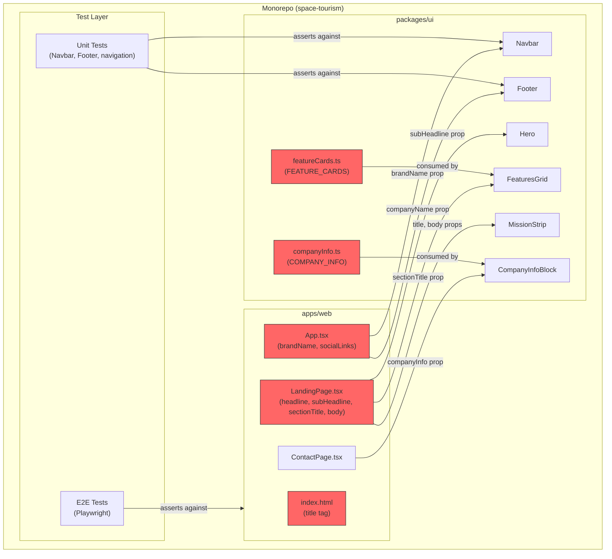
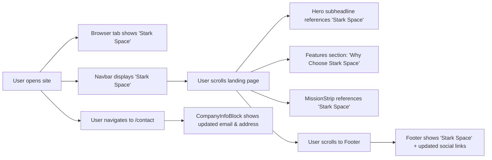
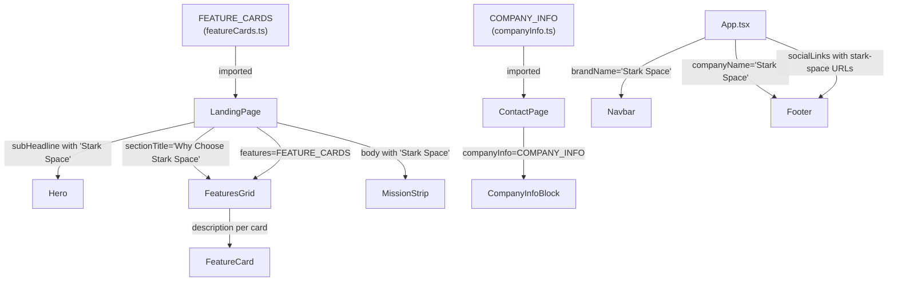
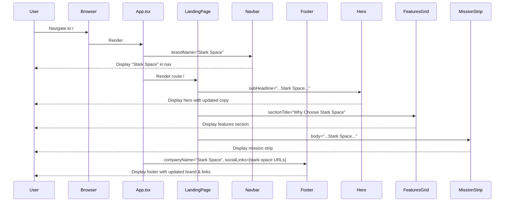

# Feature Specification: Change the Company Name to Stark Space

## Overview

Rebrand the space tourism website by replacing all instances of "Stellar Horizons" with "Stark Space" across the entire monorepo — UI text, HTML metadata, constants, social links, contact information, unit tests, and E2E tests. This is a text-level branding change with zero structural, functional, or visual modifications.

**Target Users**: All site visitors and prospective customers viewing the space tourism website.

**Business Impact**: Ensures the web application reflects the updated corporate identity "Stark Space" consistently across every user-facing surface, search-engine metadata, and contact channel.

**Success Metrics**:
- Zero occurrences of "Stellar Horizons" in rendered UI (DOM text search)
- Browser tab title reads "Stark Space"
- Social links reference `stark-space` / `starkspace` handles
- Contact email is `contact@starkspace.com`; address references "Stark Drive"
- All existing unit tests pass with updated assertions
- All existing E2E tests pass with updated assertions
- No regressions in layout, styling, navigation, or accessibility

## Requirements Summary

| ID | Requirement | Priority | Complexity | Dependencies |
|----|-------------|----------|------------|--------------|
| R1 | Replace "Stellar Horizons" with "Stark Space" in Navbar brand, Footer company name, Hero subheadline, FeaturesGrid section title, MissionStrip body, and feature card descriptions | P0 | S | None |
| R2 | Update `<title>` tag in `apps/web/index.html` to "Stark Space" | P0 | S | None |
| R3 | Update `COMPANY_INFO` constant — email to `contact@starkspace.com`, address to "1 Stark Drive..." | P0 | S | None |
| R4 | Update social media link URLs in `apps/web/src/App.tsx` to Stark Space handles | P1 | S | None |
| R5 | Update feature card descriptions in `packages/ui/src/constants/featureCards.ts` referencing old name | P1 | S | None |
| R6 | Update all hardcoded "Stellar Horizons" strings in unit tests (`Navbar.test.tsx`, `Footer.test.tsx`, `navigation.test.tsx`) | P0 | S | R1, R3 |
| R7 | Update all E2E test assertions referencing the old company name | P0 | S | R1–R5 |

## Architecture Diagrams

### System Architecture



### User Flow



### Component Data Flow



### Component Interaction (sequence diagram)



## Architecture Decision Records

### ADR-1: Pure Text Replacement — No Centralized i18n or Brand Config Refactor
- **Status**: Accepted
- **Context**: The company name is currently passed as inline string literals and constants across multiple files. An alternative approach would be to centralize all brand strings into a single config/context before replacing them.
- **Decision**: Perform a direct find-and-replace across the affected files without introducing a new branding abstraction layer.
- **Alternatives Considered**:

  | Option | Pros | Cons |
  |--------|------|------|
  | A: Direct text replacement (chosen) | Minimal diff, low risk, no architecture change, fast to implement | Name still scattered across files |
  | B: Centralize all brand strings into a BrandContext/config | Single source of truth for future rebrandings | Over-engineering for a one-time rename; adds complexity; out of scope |

- **Consequences**: If another rebrand occurs, the same multi-file replacement will be needed. This is acceptable given the small number of files (< 10) and the YAGNI principle.

### ADR-2: Derive Social Handles Using Assumed Conventions
- **Status**: Accepted
- **Context**: The exact social media handles for "Stark Space" are unconfirmed (see Open Questions Q2). We need to specify default values.
- **Decision**: Use `stark-space` (hyphenated) for GitHub and LinkedIn slugs, `starkspace` (no hyphen) for Twitter handle and email domain.
- **Alternatives Considered**:

  | Option | Pros | Cons |
  |--------|------|------|
  | A: `stark-space` / `starkspace` (chosen) | Follows common conventions; consistent with email domain | May not match actual registered handles |
  | B: Wait for confirmed handles | 100% accurate | Blocks implementation |

- **Consequences**: Handles may need a follow-up update once confirmed by the requestor.

### ADR-3: Keep Tagline Unchanged
- **Status**: Accepted
- **Context**: The current tagline "Where humanity meets the stars — your journey beyond Earth starts here." does not contain the company name. Open Question Q1 asks whether it should be updated.
- **Decision**: Keep the tagline as-is. It is brand-neutral and does not reference "Stellar Horizons."
- **Alternatives Considered**:

  | Option | Pros | Cons |
  |--------|------|------|
  | A: Keep tagline (chosen) | No unnecessary copy changes; tagline is already generic | Missed opportunity to reinforce new brand |
  | B: Rewrite tagline to include "Stark Space" | Stronger brand reinforcement | Out of scope; requires copywriter review |

- **Consequences**: Tagline remains unchanged. Can be updated separately if marketing decides.

## Component Architecture

### Component Hierarchy

```
App/
├── Navbar/                        # brandName="Stark Space" (was "Stellar Horizons")
├── Routes
│   ├── LandingPage/
│   │   ├── Hero/                  # subHeadline updated
│   │   ├── FeaturesGrid/          # sectionTitle updated
│   │   │   └── FeatureCard/       # descriptions updated via FEATURE_CARDS
│   │   ├── MissionStrip/          # title & body updated
│   │   └── CtaBanner/             # unchanged
│   └── ContactPage/
│       ├── ContactForm/           # unchanged
│       └── CompanyInfoBlock/      # consumes updated COMPANY_INFO
└── Footer/                        # companyName="Stark Space", socialLinks updated
```

### Component Specifications

#### Navbar

**Purpose**: Displays responsive navigation bar with the company brand name and navigation links.

**Location**: `packages/ui/src/components/Navbar/Navbar.tsx`

**Props Interface** (unchanged structure):
```typescript
interface NavbarProps {
  brandName: string;       // CHANGED VALUE: "Stark Space"
  links: NavLink[];
  currentPath: string;
}
```

**Event Handlers**:
| Event | Handler | Behavior | Side Effects |
|-------|---------|----------|--------------|
| Hamburger click | `toggleDrawer` | Opens mobile drawer | None |
| Escape key | `handleKeyDown` | Closes mobile drawer | None |
| Link click | `handleNavClick` | Navigates, closes drawer | Route change |

**Error Handling**:
| Error Scenario | UI Response | Recovery Action |
|----------------|-------------|-----------------|
| Empty links array | Renders brand only | Graceful degradation |

**Accessibility**:
| Requirement | Implementation |
|-------------|----------------|
| Brand name announced | Text content in `<span>`, read by screen readers |
| Active link | `aria-current="page"` on matching route |
| Drawer focus trap | Ant Design Drawer built-in |

**Performance**: Already wrapped in `React.memo`. No changes needed.

---

#### Footer

**Purpose**: Displays company name, tagline, copyright notice, and social links.

**Location**: `packages/ui/src/components/Footer/Footer.tsx`

**Props Interface** (unchanged structure):
```typescript
interface FooterProps {
  companyName: string;       // CHANGED VALUE: "Stark Space"
  tagline: string;
  socialLinks: SocialLink[]; // CHANGED VALUES: updated hrefs
  year?: number;
}
```

**Event Handlers**:
| Event | Handler | Behavior | Side Effects |
|-------|---------|----------|--------------|
| Social link click | Native `<a>` | Opens external URL | New tab |

**Error Handling**: N/A — presentational component.

**Accessibility**:
| Requirement | Implementation |
|-------------|----------------|
| Social links | `aria-label` on each link (existing) |
| Footer landmark | `<footer>` semantic element (existing) |
| Decorative icons | `aria-hidden="true"` (existing) |

**Performance**: Already `React.memo`. No changes needed.

---

#### Hero

**Purpose**: Landing page hero section with headline, subheadline, and CTA button.

**Location**: `packages/ui/src/components/Hero/Hero.tsx`

**Props Interface** (unchanged structure):
```typescript
interface HeroProps {
  headline: string;
  subHeadline: string;     // CHANGED VALUE: references "Stark Space"
  ctaLabel: string;
  onCtaClick: () => void;
  backgroundImage?: string;
}
```

**Event Handlers**:
| Event | Handler | Behavior | Side Effects |
|-------|---------|----------|--------------|
| CTA click | `onCtaClick` | Navigates to /contact | Route change |

**Error Handling**: N/A.

**Accessibility**:
| Requirement | Implementation |
|-------------|----------------|
| Heading hierarchy | `<h1>` for headline (existing) |
| CTA button | Ant Design `<Button>` with label (existing) |

**Performance**: Already `React.memo`. No changes needed.

---

#### FeaturesGrid

**Purpose**: Renders a responsive grid of feature cards with an optional section title.

**Location**: `packages/ui/src/components/FeaturesGrid/FeaturesGrid.tsx`

**Props Interface** (unchanged structure):
```typescript
interface FeaturesGridProps {
  features: FeatureCardData[];  // CHANGED VALUES: descriptions in FEATURE_CARDS
  sectionTitle?: string;        // CHANGED VALUE: "Why Choose Stark Space"
}
```

**Event Handlers**: None.

**Error Handling**:
| Error Scenario | UI Response | Recovery Action |
|----------------|-------------|-----------------|
| < 3 or > 6 features | Console warning (dev) | Renders available cards |

**Accessibility**:
| Requirement | Implementation |
|-------------|----------------|
| Section heading | `<h2>` for sectionTitle (existing) |
| Card semantics | `<article>` per card (existing) |

**Performance**: Already `React.memo`. No changes needed.

---

#### CompanyInfoBlock

**Purpose**: Displays company contact information (address, email, phone, tagline).

**Location**: `packages/ui/src/components/CompanyInfoBlock/CompanyInfoBlock.tsx`

**Props Interface** (unchanged structure):
```typescript
interface CompanyInfoBlockProps {
  companyInfo: CompanyInfo;  // CHANGED VALUES: email, address in COMPANY_INFO constant
}
```

**Event Handlers**:
| Event | Handler | Behavior | Side Effects |
|-------|---------|----------|--------------|
| Email click | Native `<a mailto:>` | Opens email client | External |
| Phone click | Native `<a tel:>` | Opens dialer | External |

**Error Handling**: N/A.

**Accessibility**:
| Requirement | Implementation |
|-------------|----------------|
| Contact semantics | `<address>` element (existing) |
| Actionable links | `mailto:` and `tel:` protocols (existing) |

**Performance**: Already `React.memo`. No changes needed.

---

#### MissionStrip

**Purpose**: Displays a mission statement section.

**Location**: `packages/ui/src/components/MissionStrip/MissionStrip.tsx`

**Props Interface** (unchanged structure):
```typescript
interface MissionStripProps {
  title: string;        // CHANGED VALUE: references "Stark Space"
  body: string;         // CHANGED VALUE: references "Stark Space"
  backgroundImage?: string;
}
```

**Event Handlers**: None.

**Error Handling**: N/A.

**Accessibility**:
| Requirement | Implementation |
|-------------|----------------|
| Section semantics | `<section>` element (existing) |

**Performance**: Already `React.memo`. No changes needed.

## State Management

### State Shape

No state shape changes. The application has no Redux store. All affected data is static string constants and inline props.

```typescript
// No state interfaces affected. For reference, existing types remain unchanged:
interface CompanyInfo {
  address: string;   // value changes to "1 Stark Drive, Cape Canaveral, FL 32920, USA"
  email: string;     // value changes to "contact@starkspace.com"
  phone: string;     // unchanged: "+1 (800) 867-5309"
  tagline: string;   // unchanged
}

interface SocialLink {
  label: string;     // unchanged
  href: string;      // values change to stark-space URLs
  icon: React.ReactNode; // unchanged
}
```

### State Ownership Matrix

| State | Owner | Reason | Access Pattern |
|-------|-------|--------|----------------|
| Company info | Static constant (`COMPANY_INFO`) | Shared across components | Import |
| Feature cards | Static constant (`FEATURE_CARDS`) | Shared across components | Import |
| Brand name | Inline prop in `App.tsx` | Passed to Navbar/Footer | Prop drilling |
| Social links | Inline array in `App.tsx` | Passed to Footer | Prop drilling |
| Page copy | Inline props in `LandingPage.tsx` | Passed to Hero/FeaturesGrid/MissionStrip | Prop drilling |
| Page title | HTML `<title>` in `index.html` | Browser tab | Static HTML |

## API Integration

### Endpoints

N/A — This is a static frontend application with no API endpoints. All data is hardcoded in constants and component props.

### Error Handling

N/A — No API calls exist.

## Performance Strategy

### Bundle Impact

| Addition | Size | Justification | Alternative Considered |
|----------|------|---------------|------------------------|
| None | 0 KB | Text-only change; no new dependencies or assets | N/A |

### Render Optimization

| Component | Memoization | Reason |
|-----------|-------------|--------|
| All affected components | Already `React.memo` | No changes needed; string prop changes trigger normal re-render |

**Code Splitting**: No changes. Existing `React.lazy()` for `LandingPage` and `ContactPage` in `App.tsx` remains unchanged.

## Testing Strategy

### Test Matrix

| Component/File | Unit | Integration | E2E | Notes |
|----------------|------|-------------|-----|-------|
| `Navbar.test.tsx` | Yes | — | — | Update "Stellar Horizons" assertions to "Stark Space" |
| `Footer.test.tsx` | Yes | — | — | Update company name assertions to "Stark Space" |
| `navigation.test.tsx` | Yes | — | — | Update assertion on brand name |
| `landing.spec.ts` | — | — | Yes | Verify hero, features, mission strip text |
| `navigation.spec.ts` | — | — | Yes | Verify navbar brand text if asserted |
| `contact-form.spec.ts` | — | — | Yes | Verify CompanyInfoBlock shows updated email/address |
| `mobile-navbar.spec.ts` | — | — | Yes | Verify mobile nav brand text if asserted |

### Verification Approach

1. Run `pnpm test` — all unit tests must pass with updated assertions
2. Run `pnpm exec playwright test` — all E2E tests must pass
3. Perform a global text search for "Stellar Horizons" — zero results expected in source and test files
4. Visual inspection of rendered pages at desktop and mobile viewports

## Security

| Concern | Mitigation | Implementation |
|---------|------------|----------------|
| XSS via injected brand name | Brand name is a static string literal, not user input | No dynamic input; hardcoded constants |
| CSP headers | Existing CSP in `index.html` unchanged | No new scripts or external resources |
| Sensitive data exposure | No sensitive data involved | Text replacement only |
| External link integrity | Social links point to external domains | Existing `target="_blank"` with `rel="noopener noreferrer"` |

## Accessibility

- [x] All interactive elements have accessible names — unchanged
- [x] Dynamic content uses `aria-live` regions — N/A (no dynamic content changes)
- [x] Form fields have associated labels — unchanged
- [x] Error states announced to screen readers — unchanged
- [x] Focus management on modal open/close — unchanged (drawer behavior intact)
- [x] Keyboard navigation: Tab, Arrow, Enter, Escape — unchanged
- [x] Screen readers will announce "Stark Space" correctly (two common English words, no pronunciation issues)

## Implementation Checklist

### Phase 1: Constants & Static Assets
- [ ] Update `<title>` in `apps/web/index.html` from "Stellar Horizons" to "Stark Space"
- [ ] Update `COMPANY_INFO` in `packages/ui/src/constants/companyInfo.ts` — email to `contact@starkspace.com`, address to "1 Stark Drive, Cape Canaveral, FL 32920, USA"
- [ ] Update feature card descriptions in `packages/ui/src/constants/featureCards.ts` replacing "Stellar Horizons" with "Stark Space"

### Phase 2: Component Props & Inline Strings
- [ ] Update `brandName` prop value in `apps/web/src/App.tsx` to "Stark Space"
- [ ] Update `companyName` prop value in `apps/web/src/App.tsx` to "Stark Space"
- [ ] Update social link URLs in `apps/web/src/App.tsx` to `github.com/stark-space`, `twitter.com/starkspace`, `linkedin.com/company/stark-space`
- [ ] Update `subHeadline` prop in `apps/web/src/pages/LandingPage.tsx` to reference "Stark Space"
- [ ] Update `sectionTitle` prop in `apps/web/src/pages/LandingPage.tsx` to "Why Choose Stark Space"
- [ ] Update MissionStrip `title` and `body` props in `apps/web/src/pages/LandingPage.tsx` to reference "Stark Space"

### Phase 3: Test Updates
- [ ] Update `packages/ui/src/components/Navbar/Navbar.test.tsx` — change all "Stellar Horizons" assertions to "Stark Space"
- [ ] Update `packages/ui/src/components/Footer/Footer.test.tsx` — change all "Stellar Horizons" assertions to "Stark Space"
- [ ] Update `apps/web/src/__tests__/navigation.test.tsx` — change "Stellar Horizons" assertion to "Stark Space"
- [ ] Update E2E tests in `e2e/` that assert on the old company name, email, or address

### Phase 4: Verification
- [ ] Run full unit test suite — all passing
- [ ] Run full E2E test suite — all passing
- [ ] Global grep for "Stellar Horizons" returns zero results in source and tests
- [ ] Visual smoke test at desktop (1280px) and mobile (375px) viewports

## File Structure

```
space-tourism/
├── apps/
│   └── web/
│       ├── index.html                          # ← Update <title>
│       └── src/
│           ├── App.tsx                         # ← Update brandName, companyName, socialLinks
│           ├── pages/
│           │   ├── LandingPage.tsx             # ← Update subHeadline, sectionTitle, mission text
│           │   └── ContactPage.tsx             #   (unchanged — consumes COMPANY_INFO)
│           └── __tests__/
│               └── navigation.test.tsx         # ← Update assertions
├── packages/
│   └── ui/
│       └── src/
│           ├── constants/
│           │   ├── companyInfo.ts              # ← Update email, address
│           │   └── featureCards.ts             # ← Update descriptions
│           ├── components/
│           │   ├── Navbar/
│           │   │   └── Navbar.test.tsx         # ← Update assertions
│           │   └── Footer/
│           │       └── Footer.test.tsx         # ← Update assertions
│           └── types.ts                        #   (unchanged)
└── e2e/
    ├── landing.spec.ts                         # ← Update assertions if applicable
    ├── navigation.spec.ts                      # ← Update assertions if applicable
    ├── contact-form.spec.ts                    # ← Update assertions if applicable
    └── mobile-navbar.spec.ts                   # ← Update assertions if applicable
```

## Open Questions

| ID | Question | Owner | Due | Status |
|----|----------|-------|-----|--------|
| Q1 | Should the tagline be updated to mention "Stark Space" explicitly? Current assumption: keep unchanged (brand-neutral). | Requestor | TBD | Open |
| Q2 | What are the confirmed social media handles for Stark Space? Current assumption: `github.com/stark-space`, `twitter.com/starkspace`, `linkedin.com/company/stark-space`. | Requestor | TBD | Open |
| Q3 | Should the contact email be `contact@starkspace.com` or `contact@stark-space.com`? Current assumption: `contact@starkspace.com`. | Requestor | TBD | Open |
| Q4 | Should the street address change from "1 Stellar Drive" to "1 Stark Drive"? Current assumption: yes. | Requestor | TBD | Open |
| Q5 | Should package names (`@space-tourism/web`, `@space-tourism/ui`) be updated? Current assumption: no — out of scope. | Requestor | TBD | Open |
