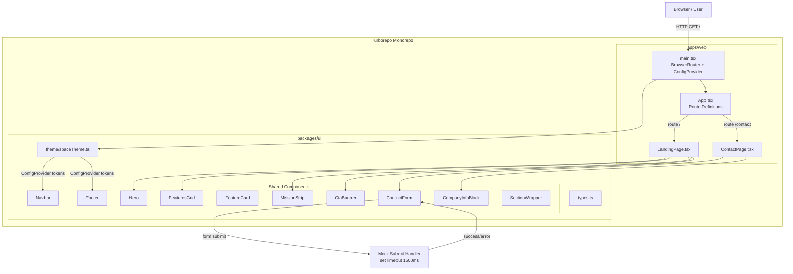
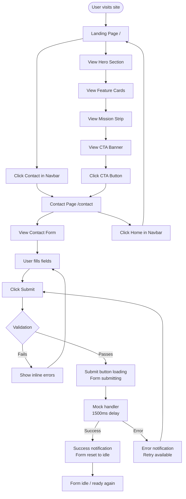
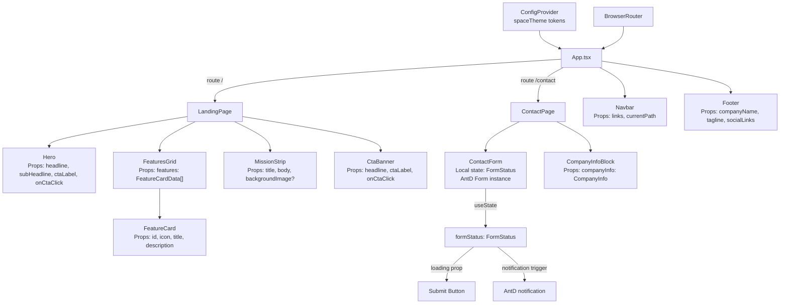
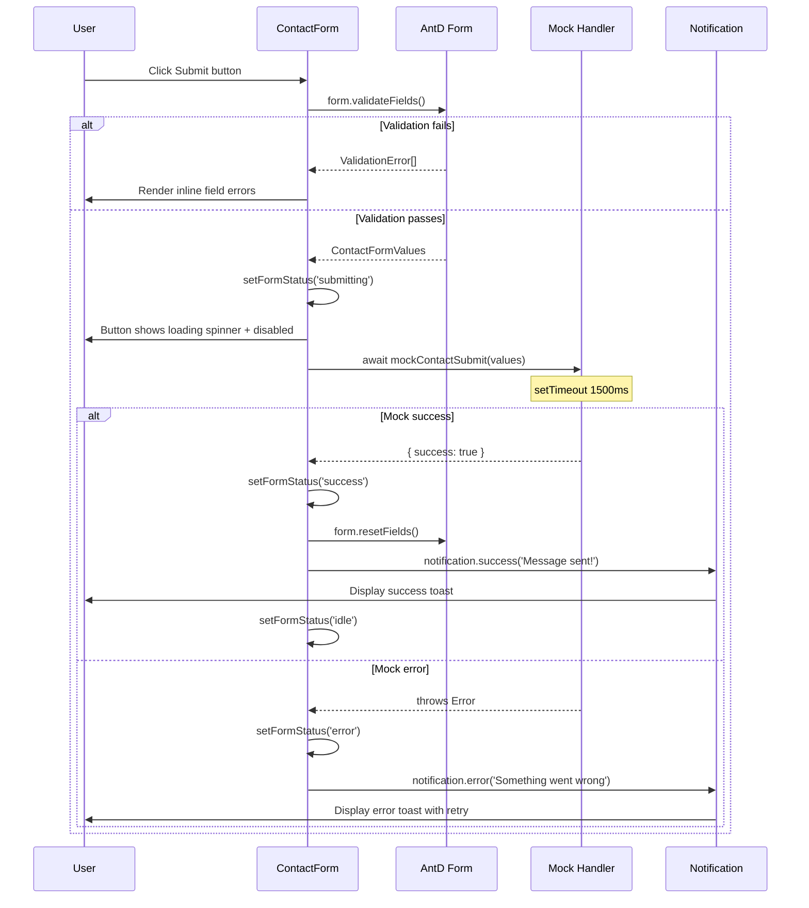

# Feature Specification: Space Tourism Company — Landing Page & Contact Page

## Overview

A two-page marketing website for a fictional space tourism company built inside a Turborepo monorepo. The site features a minimalist, dark space-inspired aesthetic powered by React 18, Ant Design 5.x, and Vite, enabling prospective travellers to explore the company's offerings and submit contact enquiries.

**Target Users**: Prospective space travellers and general consumers browsing space tourism offerings; visitors on desktop and mobile devices.

**Business Impact**: Establishes a professional, conversion-oriented web presence for the space tourism brand. The contact form generates inbound leads. The Turborepo scaffold provides an extensible foundation for future booking flows, dashboards, and additional packages.

**Success Metrics**:
- Turbo `build` and `dev` pipelines run without errors; incremental cache hits complete in < 5 s
- Lighthouse Performance score ≥ 85; First Contentful Paint < 2 s on broadband
- Total initial JS bundle < 300 KB gzipped
- Zero WCAG 2.1 AA accessibility violations reported by automated audit
- Contact form submission happy-path E2E test passes consistently
- No horizontal overflow on viewports ≥ 320 px wide

---

## Requirements Summary

| ID  | Requirement                        | Priority | Complexity | Dependencies       |
|-----|------------------------------------|----------|------------|--------------------|
| F1  | Turborepo monorepo scaffold        | P0       | M          | None               |
| F2  | Shared UI package (`packages/ui`)  | P0       | M          | F1                 |
| F3  | Landing page — Hero section        | P0       | S          | F2, F11, F12       |
| F4  | Landing page — Features section    | P0       | S          | F2, F12            |
| F5  | Landing page — Mission strip       | P1       | S          | F2, F12            |
| F6  | Landing page — CTA banner          | P1       | S          | F2, F11, F12       |
| F7  | Contact page — Contact form        | P0       | M          | F2, F12            |
| F8  | Contact page — Company info block  | P1       | S          | F2                 |
| F9  | Shared Navbar                      | P0       | M          | F2, F11            |
| F10 | Shared Footer                      | P1       | S          | F2                 |
| F11 | Client-side routing (React Router) | P0       | S          | F1                 |
| F12 | Minimalist space theme             | P0       | S          | F2                 |
| BR-1| Name validation (2–100 chars)      | P0       | S          | F7                 |
| BR-2| Email RFC 5322 validation          | P0       | S          | F7                 |
| BR-3| Subject validation (3–150 chars)   | P0       | S          | F7                 |
| BR-4| Message validation (10–1000 chars) | P0       | S          | F7                 |
| BR-5| Submit button disabled while loading| P0      | S          | F7                 |
| BR-6| Form reset on successful submit    | P0       | S          | F7                 |
| BR-7| Feature cards: min 3, max 6        | P0       | S          | F4                 |

---

## Architecture Diagrams

### System Architecture



### User Flow



### Component Data Flow



### Component Interaction (sequence diagram)



---

## Architecture Decision Records

### ADR-1: Turborepo with pnpm Workspaces as Monorepo Tool

- **Status**: Accepted
- **Context**: The requirement specifies a Turborepo monorepo hosting at least one app (`apps/web`) and one shared package (`packages/ui`). A package manager with native workspace support is needed.
- **Decision**: Use Turborepo 2.x for build orchestration with pnpm 8+ as the workspace package manager. Root `turbo.json` defines `build`, `dev`, and `lint` pipelines with caching enabled.
- **Alternatives Considered**:
  | Option | Pros | Cons |
  |--------|------|------|
  | pnpm workspaces + Turborepo | First-class Turborepo recommendation; fast installs; disk-efficient | Team must have pnpm familiarity |
  | npm workspaces + Turborepo | No extra tooling | Slower installs; less mature workspace support |
  | yarn workspaces + Turborepo | Widely known | Yarn 1 deprecated; competing lockfile ecosystems |
  | Nx | More powerful task graph | Heavier; steeper learning curve; overkill for 2-page site |
- **Consequences**: All developers must use pnpm. CI/CD pipelines require `pnpm install` step. Provides fast incremental builds via Turbo remote-cache-ready config. Q2 (package manager choice) remains open; pnpm is assumed.

### ADR-2: Vite 5.x as Build Tool for `apps/web`

- **Status**: Accepted
- **Context**: Requirements exclude SSR/Next.js. A fast dev server and optimised production bundler are needed for a React SPA.
- **Decision**: Use Vite 5.x with `@vitejs/plugin-react` inside `apps/web`. Code-split Ant Design icons via named imports. Use `manualChunks` to separate vendor bundles and keep initial JS under 300 KB gzipped.
- **Alternatives Considered**:
  | Option | Pros | Cons |
  |--------|------|------|
  | Vite 5.x | Fast HMR; native ESM; lightweight config | No SSR out of the box (not required) |
  | Next.js App Router | SSR/SSG; SEO-ready | Overkill for static marketing site; conflicts with SPA assumption |
  | Webpack 5 | Mature; large ecosystem | Slow cold starts; verbose config |
- **Consequences**: Build output is a static SPA deployable to Vercel, Netlify, or GitHub Pages. Q3 (Vite vs Next.js) remains open; Vite is the default assumption.

### ADR-3: Ant Design 5.x with CSS-in-JS Theme Tokens

- **Status**: Accepted
- **Context**: Requirements mandate Ant Design with a minimalist dark space theme. Ant Design 5.x provides a Design Token system via `ConfigProvider` enabling deep theming without CSS override battles.
- **Decision**: Apply all design customisations exclusively through `ConfigProvider` token overrides defined in `packages/ui/src/theme/spaceTheme.ts`, using `theme.darkAlgorithm` as the base. Component-level layout adjustments (e.g., hero full-viewport height) use CSS Modules scoped to each component.
- **Alternatives Considered**:
  | Option | Pros | Cons |
  |--------|------|------|
  | AntD tokens only | Consistent; upgradeable; no specificity wars | Some layout needs still require scoped CSS |
  | AntD + Tailwind | Utility classes for layout | Two styling systems; bundle overhead |
  | AntD + custom SCSS | Full control | Specificity conflicts; brittle on AntD upgrades |
- **Consequences**: Dark mode is achieved via `algorithm: theme.darkAlgorithm` plus custom token overrides. Hero full-viewport height and section padding use CSS Modules.

### ADR-4: Local State Only — No Redux or Zustand

- **Status**: Accepted
- **Context**: The application has two pages with no shared mutable state between them. The contact form state is scoped to a single component. Theme is provided via `ConfigProvider` context.
- **Decision**: Use React `useState` for contact form status (`FormStatus`). Ant Design `Form` instance manages field values internally. No global state library is introduced.
- **Alternatives Considered**:
  | Option | Pros | Cons |
  |--------|------|------|
  | useState / useReducer | Zero overhead; sufficient for scope | Does not scale if cross-page state is added later |
  | Zustand | Lightweight; easy migration | Unnecessary for current scope; adds dependency |
  | Redux Toolkit | Industry standard; scalable | Significant boilerplate for a 2-page site |
- **Consequences**: Future booking flows or auth pages will require introducing a global store. Acceptable given the current scope explicitly excludes those features.

### ADR-5: React Router v6 BrowserRouter for Client-Side Routing

- **Status**: Accepted
- **Context**: Two routes (`/` and `/contact`) are needed with link navigation. No SSR is used.
- **Decision**: Use `BrowserRouter` with declarative `Routes`/`Route` in `App.tsx`. Lazy-load page components via `React.lazy` and `Suspense` to enable route-level code splitting.
- **Alternatives Considered**:
  | Option | Pros | Cons |
  |--------|------|------|
  | React Router v6 BrowserRouter | Standard; well-documented; clean URLs | Requires server-side catch-all for static hosting |
  | React Router v6 HashRouter | Works on any static host without config | Hash `#` in URL; poor UX and SEO |
  | TanStack Router | Type-safe routes | Smaller ecosystem; overkill for 2 routes |
- **Consequences**: Static hosting (Vercel, Netlify) must redirect all paths to `index.html`. A `_redirects` file or `vercel.json` must be included in `apps/web/public/`.

---

## Component Architecture

### Component Hierarchy

```
apps/web/src/
└── main.tsx                             # React root: BrowserRouter + ConfigProvider
    └── App.tsx                          # Route switch + Navbar + Footer layout shell
        ├── Navbar                       # Shared — reads useLocation for active link
        ├── Suspense boundary
        │   ├── LandingPage              # Route: /  (lazy-loaded)
        │   │   ├── Hero                 # Full-viewport hero
        │   │   ├── FeaturesGrid         # Responsive grid of feature cards
        │   │   │   └── FeatureCard (×3–6)
        │   │   ├── MissionStrip         # Company mission blurb
        │   │   └── CtaBanner            # Bottom CTA
        │   └── ContactPage              # Route: /contact  (lazy-loaded)
        │       ├── ContactForm          # Smart: owns FormStatus state machine
        │       └── CompanyInfoBlock     # Presentational: address / email / phone
        └── Footer                       # Shared — presentational
```

### Component Specifications

---

#### `Navbar`

**Purpose**: Site-wide navigation bar rendering brand name and route links. Collapses to a hamburger + Ant Design `Drawer` on mobile viewports (< 768 px).

**Location**: `packages/ui/src/components/Navbar/Navbar.tsx`

**Props Interface**:
```typescript
interface NavbarProps {
  /** Brand / logo text to display */
  brandName: string;
  /** Navigation link definitions */
  links: Array<{ label: string; to: string }>;
  /** Current pathname for active-link highlighting */
  currentPath: string;
}
```

**Event Handlers**:
| Event | Handler | Behavior | Side Effects |
|-------|---------|----------|--------------|
| Desktop link click | React Router `<Link>` | Client-side navigation | URL change |
| Hamburger icon click | `handleDrawerOpen` | Opens AntD `Drawer` | `drawerOpen → true` |
| Drawer overlay / X click | `handleDrawerClose` | Closes drawer | `drawerOpen → false` |
| Drawer link click | `handleDrawerLinkClick` | Navigate then close drawer | URL change + drawer closed |

**Error Handling**:
| Error Scenario | UI Response | Recovery Action |
|----------------|-------------|-----------------|
| Empty `links` array | Render brand only; no nav items | Graceful degradation |

**Accessibility**:
| Requirement | Implementation |
|-------------|----------------|
| Hamburger button | `aria-label="Open navigation"` |
| Drawer close button | `aria-label="Close navigation"` |
| Active link | `aria-current="page"` on matching route |
| Drawer escape | Pressing Escape closes drawer |
| Nav landmark | `<nav>` wraps all link lists |

**Performance**: `React.memo` — props are stable string/array references; re-renders only on route change.

---

#### `Footer`

**Purpose**: Site-wide footer with copyright notice, tagline, and placeholder social links.

**Location**: `packages/ui/src/components/Footer/Footer.tsx`

**Props Interface**:
```typescript
interface FooterProps {
  companyName: string;
  tagline: string;
  socialLinks: Array<{ label: string; href: string; icon: React.ReactNode }>;
  /** Defaults to current year */
  year?: number;
}
```

**Accessibility**:
| Requirement | Implementation |
|-------------|----------------|
| Semantic landmark | `<footer>` element |
| Social link labels | `aria-label` on each anchor (e.g. `"Follow us on Twitter"`) |
| Decorative icons | `aria-hidden="true"` on icon nodes |

**Performance**: `React.memo` — entirely static content.

---

#### `Hero`

**Purpose**: Full-viewport opening section of the landing page with headline, sub-headline, and primary CTA button.

**Location**: `packages/ui/src/components/Hero/Hero.tsx`

**Props Interface**:
```typescript
interface HeroProps {
  headline: string;
  subHeadline: string;
  ctaLabel: string;
  onCtaClick: () => void;
  /** Optional background image URL; falls back to CSS dark-to-blue gradient */
  backgroundImage?: string;
}
```

**Event Handlers**:
| Event | Handler | Behavior | Side Effects |
|-------|---------|----------|--------------|
| CTA button click | `onCtaClick` prop | Caller invokes `useNavigate('/contact')` | Route change |

**Accessibility**:
| Requirement | Implementation |
|-------------|----------------|
| Page heading | `<h1>` for headline (one per page) |
| Background | Decorative via CSS `background-image`; no `` required |
| CTA button | Descriptive label; implicit `role="button"` from AntD `Button` |

**Performance**: Hero background applied via CSS; no JS bundle impact. `React.memo` applied.

---

#### `FeatureCard`

**Purpose**: Individual card displaying an icon, title, and description for a single company offering.

**Location**: `packages/ui/src/components/FeatureCard/FeatureCard.tsx`

**Props Interface**:
```typescript
interface FeatureCardProps {
  id: string;
  /** AntD icon component or emoji fallback */
  icon: React.ReactNode;
  title: string;
  description: string;
}
```

**Accessibility**:
| Requirement | Implementation |
|-------------|----------------|
| Semantic wrapper | `<article>` element around AntD `Card` |
| Card heading | `<h3>` for card title within `<article>` |
| Decorative icon | `aria-hidden="true"` |

**Performance**: `React.memo` — props are static data objects.

---

#### `FeaturesGrid`

**Purpose**: Responsive grid container rendering 3–6 `FeatureCard` components using AntD `Row`/`Col`.

**Location**: `packages/ui/src/components/FeaturesGrid/FeaturesGrid.tsx`

**Props Interface**:
```typescript
interface FeaturesGridProps {
  features: FeatureCardData[]; // min 3, max 6 enforced via dev warnings
  sectionTitle?: string;
}
```

**Error Handling**:
| Error Scenario | UI Response | Recovery Action |
|----------------|-------------|-----------------|
| `features.length < 3` | `console.warn` in development | Render available cards |
| `features.length > 6` | `console.warn` in development | Slice to first 6 |

**Responsive Column Config**:
| Breakpoint | AntD `Col` span |
|------------|-----------------|
| xs (< 576 px) | 24 (1 column) |
| sm (576–768 px) | 24 (1 column) |
| md (768–1024 px) | 12 (2 columns) |
| lg / xl (> 1024 px) | 6–8 (3–4 columns) |

**Performance**: `React.memo` — features array is a static module-level constant.

---

#### `MissionStrip`

**Purpose**: Full-width section presenting the company mission statement with optional decorative background.

**Location**: `packages/ui/src/components/MissionStrip/MissionStrip.tsx`

**Props Interface**:
```typescript
interface MissionStripProps {
  title: string;
  body: string;
  /** Optional decorative background image URL */
  backgroundImage?: string;
}
```

**Accessibility**:
| Requirement | Implementation |
|-------------|----------------|
| Section heading | `<h2>` for section title |
| Background | Decorative CSS; no `` alt required |

---

#### `CtaBanner`

**Purpose**: Bottom-of-page call-to-action banner prompting users to navigate to the contact page.

**Location**: `packages/ui/src/components/CtaBanner/CtaBanner.tsx`

**Props Interface**:
```typescript
interface CtaBannerProps {
  headline: string;
  ctaLabel: string;
  onCtaClick: () => void;
}
```

---

#### `ContactForm`

**Purpose**: Smart component owning the full contact form lifecycle — field rendering, AntD Form validation, mock submission, `FormStatus` state machine transitions, and success/error feedback via AntD notifications.

**Location**: `packages/ui/src/components/ContactForm/ContactForm.tsx`

**Props Interface**:
```typescript
interface ContactFormProps {
  /**
   * Override the default mock submit function.
   * Enables dependency injection for testing error paths.
   */
  onSubmit?: (values: ContactFormValues) => Promise<void>;
}
```

**Internal State**:
```typescript
// Managed via useState<FormStatus> inside ContactForm
type FormStatus = 'idle' | 'dirty' | 'submitting' | 'success' | 'error';
// AntD Form instance manages field values internally via useForm()
```

**Event Handlers**:
| Event | Handler | Behavior | Side Effects |
|-------|---------|----------|--------------|
| Any field change | AntD `onValuesChange` | Sets status → `'dirty'` | None |
| Submit click | `handleSubmit` | Calls `form.validateFields()` | Async mock dispatch |
| Validation fails | AntD internal | Renders inline errors | Status stays `'dirty'` |
| Validation passes | `handleSubmit` (cont.) | Sets status → `'submitting'`; disables button | Async mock called |
| Mock success | `handleSuccess` | `form.resetFields()`; status → `'idle'`; success notification | AntD notification API |
| Mock error | `handleError` | Status → `'error'`; error notification | AntD notification API |

**Validation Rules**:
| Field | Rules |
|-------|-------|
| `name` | required; pattern `/^[a-zA-Z\s]{2,100}$/` |
| `email` | required; AntD `type: 'email'` |
| `subject` | required; `min: 3`; `max: 150` |
| `message` | required; `min: 10`; `max: 1000` |

**Error Handling**:
| Error Scenario | UI Response | Recovery Action |
|----------------|-------------|-----------------|
| Empty required field | AntD inline "Field is required" | User fills field |
| Invalid email | Inline "Please enter a valid email" | User corrects email |
| Name length violation | Inline length message | User edits name |
| Message length violation | Inline length message | User edits message |
| Mock network error | `notification.error` toast | User may re-submit |

**Accessibility**:
| Requirement | Implementation |
|-------------|----------------|
| Field labels | AntD `Form.Item` renders `<label>` via `name`/`label` prop |
| Error association | AntD links error messages via `aria-describedby` internally |
| Required fields | `aria-required="true"` on all required inputs |
| Submitting state | Submit button `aria-busy="true"` while loading |
| Notifications | AntD notification uses `aria-live="polite"` region |

**Performance**: No memoisation — component must re-render on `FormStatus` state changes.

---

#### `CompanyInfoBlock`

**Purpose**: Presentational display of fictional company contact details (address, email, phone).

**Location**: `packages/ui/src/components/CompanyInfoBlock/CompanyInfoBlock.tsx`

**Props Interface**:
```typescript
interface CompanyInfoBlockProps {
  companyInfo: CompanyInfo;
}
```

**Accessibility**:
| Requirement | Implementation |
|-------------|----------------|
| Address semantics | Wrapped in `<address>` element |
| Email link | `<a href="mailto:...">` |
| Phone link | `<a href="tel:...">` |

**Performance**: `React.memo` — static props object; never changes at runtime.

---

#### `SectionWrapper`

**Purpose**: Utility layout wrapper providing consistent vertical padding and horizontal max-width centering across all page sections.

**Location**: `packages/ui/src/components/SectionWrapper/SectionWrapper.tsx`

**Props Interface**:
```typescript
interface SectionWrapperProps {
  children: React.ReactNode;
  /** Semantic HTML element to render. Default: 'section' */
  as?: 'section' | 'div' | 'article' | 'aside';
  /** Additional CSS class for variant overrides */
  className?: string;
  /** Points to the section heading id for landmark labelling */
  'aria-labelledby'?: string;
}
```

---

## State Management

### State Shape

```typescript
// packages/ui/src/types.ts  (interfaces — not implementation)

export interface FeatureCardData {
  id: string;
  icon: React.ReactNode;
  title: string;
  description: string;
}

export interface CompanyInfo {
  address: string;
  email: string;
  phone: string;
  tagline: string;
}

export interface ContactFormValues {
  name: string;
  email: string;
  subject: string;
  message: string;
}

export type FormStatus = 'idle' | 'dirty' | 'submitting' | 'success' | 'error';

export interface SpaceTheme {
  colorPrimary: string;        // '#4F8EF7'  — electric blue
  colorBgBase: string;         // '#0A0A0F'  — near-black
  colorBgContainer: string;    // '#14141F'  — card background
  colorBorder: string;         // '#2A2A3A'  — subtle border
  colorTextBase: string;       // '#E8E8E8'  — off-white
  colorTextSecondary: string;  // '#8A8A9A'  — muted grey
  borderRadius: number;        // 4
  fontFamily: string;
}
```

### State Ownership Matrix

| State | Owner | Reason | Access Pattern |
|-------|-------|--------|----------------|
| `formStatus: FormStatus` | `ContactForm` (local `useState`) | Scoped to single component lifecycle | `setFormStatus(...)` |
| Form field values | AntD `Form` instance (internal) | AntD manages via `useForm` subscription | `form.getFieldsValue()` / `form.resetFields()` |
| `drawerOpen: boolean` | `Navbar` (local `useState`) | UI-only toggle; not shared outside component | `setDrawerOpen(...)` |
| Active route / URL | React Router `BrowserRouter` | URL is source of truth for the current page | `useLocation()`, `useNavigate()` |
| Theme tokens | AntD `ConfigProvider` context | Global read-only design tokens set at app root | AntD internal context / CSS variables |
| Static content (features, companyInfo, navLinks) | Module-level constants | Immutable hardcoded data; no mutation | Direct ES module import |

---

## API Integration

### Endpoints

| Method | Endpoint | Request Body | Response | Cache TTL | Invalidates |
|--------|----------|--------------|----------|-----------|-------------|
| N/A — mock | `mockContactSubmit()` | `ContactFormValues` | `{ success: true, message: string }` | N/A | N/A |

> No real HTTP endpoints exist in v1.0. All page content is static; contact form uses a client-side mock function only.

### Mock Submit Contract

```typescript
// packages/ui/src/utils/mockSubmit.ts  (specification — not implementation)

interface MockSubmitOptions {
  /** If true, the mock throws an Error instead of resolving. For test/dev use. */
  simulateError?: boolean;
}

interface MockSubmitResult {
  success: true;
  message: string;
}

async function mockContactSubmit(
  values: ContactFormValues,
  options?: MockSubmitOptions
): Promise<MockSubmitResult>;

// Behaviour contract:
// 1. await new Promise(resolve => setTimeout(resolve, 1500))
// 2. if (options?.simulateError) throw new Error('Network error')
// 3. return { success: true, message: 'Message received' }
```

### Error Handling

| Scenario | User Message | Recovery |
|----------|--------------|----------|
| Client validation failure | AntD inline field error messages | User corrects fields and re-submits |
| Mock simulated error | `notification.error`: "Something went wrong. Please try again." | User may re-click Submit |
| Future HTTP 400 | "Please check your input" | Display server-side field errors |
| Future HTTP 401 | "Session expired" | Redirect to login |
| Future HTTP 500 | "Something went wrong" | Retry with exponential back-off |

---

## Performance Strategy

### Bundle Impact

| Addition | Estimated Size (gzipped) | Justification | Alternative Considered |
|----------|--------------------------|---------------|------------------------|
| React + ReactDOM 18 | ~45 KB | Core framework — required | N/A |
| Ant Design 5.x (tree-shaken) | ~80–120 KB | Required per spec | Smaller UI lib — not an option |
| @ant-design/icons (selected) | ~5–15 KB | Named imports only; not barrel | Full icon bundle ~200 KB — rejected |
| React Router v6 | ~15 KB | Required for routing | N/A |
| CSS Modules (scoped styles) | ~5 KB | Zero-runtime styling for layout | Tailwind — two style systems |
| **Total target** | **< 300 KB** | NFR requirement | — |

### Render Optimization

| Component | Strategy | Reason |
|-----------|----------|--------|
| `Navbar` | `React.memo` | Renders on every route; props are stable |
| `Footer` | `React.memo` | Static content; never changes |
| `FeatureCard` | `React.memo` | Rendered in a list from a static array |
| `FeaturesGrid` | `React.memo` | Static features constant; no runtime mutation |
| `Hero` | `React.memo` | Props passed once from parent constant |
| `CompanyInfoBlock` | `React.memo` | Pure presentational; static props object |
| `ContactForm` | None | Owns mutable `FormStatus` state; must re-render |

### Code Splitting

```
Route-level lazy loading via React.lazy + Suspense at App.tsx:
  LandingPage  → React.lazy(() => import('./pages/LandingPage'))
  ContactPage  → React.lazy(() => import('./pages/ContactPage'))

Suspense fallback: Full-page AntD Spin centered on dark background.

AntD icon rule — named imports ONLY:
  Correct:   import { RocketOutlined } from '@ant-design/icons'
  Incorrect: import * as Icons from '@ant-design/icons'   // ~200 KB penalty

Vite manualChunks strategy (vite.config.ts — specification only):
  'vendor-react': ['react', 'react-dom', 'react-router-dom']
  'vendor-antd':  ['antd', '@ant-design/icons']
```

---

## Testing Strategy

### Test Matrix

| Component / Module | Unit | Integration | E2E | Notes |
|--------------------|------|-------------|-----|-------|
| `SectionWrapper` | Yes | No | No | Element type prop, className pass-through |
| `FeatureCard` | Yes | No | No | Renders title, description, icon |
| `FeaturesGrid` | Yes | No | No | Min/max card count warnings, col spans |
| `Hero` | Yes | No | Yes | Headline visible; CTA click navigates (E2E-1) |
| `MissionStrip` | Yes | No | No | Title and body render |
| `CtaBanner` | Yes | No | No | `onCtaClick` called on button click |
| `CompanyInfoBlock` | Yes | No | No | Address, email, phone present |
| `Navbar` (desktop) | Yes | Yes | No | Links render; `aria-current` on active link |
| `Navbar` (mobile) | Yes | Yes | Yes | Hamburger visible; drawer open/close (E2E-5) |
| `Footer` | Yes | No | No | Copyright text, social link hrefs |
| `ContactForm` — empty submit | Yes | Yes | Yes | All required errors visible (E2E-3) |
| `ContactForm` — invalid email | Yes | No | Yes | Inline email error (E2E-3) |
| `ContactForm` — happy path | Yes | Yes | Yes | Loading → success → reset (E2E-4) |
| `ContactForm` — error path | Yes | Yes | No | Error notification; status → `'error'` |
| `mockContactSubmit` | Yes | No | No | Resolves ~1500ms; throws on `simulateError` |
| `spaceTheme` tokens | Yes | No | No | Token values match design spec constants |
| `LandingPage` (full page) | No | Yes | Yes | Page composition; scroll to footer (E2E-1) |
| `ContactPage` (full page) | No | Yes | Yes | Form + info block layout |
| Navigation `/` → `/contact` | No | Yes | Yes | URL and content change (E2E-2) |
| Navigation `/contact` → `/` | No | Yes | Yes | URL and content change (E2E-2) |
| Responsive no overflow | No | No | Yes | 375 px viewport; no horizontal scroll (E2E-6) |

**Tooling**:
- **Unit & Integration**: Vitest + React Testing Library; `@testing-library/user-event`; `@testing-library/jest-dom`; `axe-core` via `@axe-core/react` or `jest-axe`
- **E2E**: Playwright (`e2e/*.spec.ts`); base URL `http://localhost:5173`
- **Coverage split target**: 60% unit · 30% integration · 10% E2E

**Representative Test Sketches** (illustration only):

```typescript
// Unit — ContactForm: empty submit shows all errors
test('shows required errors on empty submit', async () => {
  render(<ContactForm />);
  await userEvent.click(screen.getByRole('button', { name: /submit/i }));
  expect(screen.getByText(/name.*required/i)).toBeInTheDocument();
  expect(screen.getByText(/email.*required/i)).toBeInTheDocument();
  expect(screen.getByText(/subject.*required/i)).toBeInTheDocument();
  expect(screen.getByText(/message.*required/i)).toBeInTheDocument();
});

// E2E — Contact form happy path (E2E-4)
test('contact form happy path', async ({ page }) => {
  await page.goto('/contact');
  await page.fill('[name="name"]', 'Jane Doe');
  await page.fill('[name="email"]', 'jane@example.com');
  await page.fill('[name="subject"]', 'Space inquiry');
  await page.fill('[name="message"]', 'I would like to book a trip to Mars.');
  await page.click('button[type="submit"]');
  await expect(page.getByRole('button', { name: /submit/i })).toBeDisabled();
  await expect(page.getByText(/message sent/i)).toBeVisible();
  await expect(page.getByLabel('Name')).toHaveValue('');
});
```

---

## Security

| Concern | Mitigation | Implementation |
|---------|------------|----------------|
| XSS via form input | No user input rendered as HTML | AntD `Input`/`TextArea` render as text nodes; `dangerouslySetInnerHTML` never used |
| Sensitive data exposure | No API keys, tokens, or secrets in source | `.env` excluded from repo; contact form is mock-only |
| Third-party dependency vulnerabilities | Lockfile pinning + audit | `pnpm audit` in CI; `pnpm install --frozen-lockfile` |
| Content Security Policy | Restrict inline scripts | Meta CSP tag or hosting-level header; disallow `unsafe-inline` scripts |
| Clickjacking | Frame restriction | `X-Frame-Options: SAMEORIGIN` via hosting config header |
| Dependency confusion | Scoped package names | All internal packages use `@space-tourism/` scope (e.g. `@space-tourism/ui`) |
| Form spam (future) | reCAPTCHA / rate limiting | Out of scope for v1.0; mock-only form poses no risk |

---

## Accessibility

- [x] All interactive elements have accessible names (`aria-label` or associated visible label)
- [x] `Navbar` hamburger button: `aria-label="Open navigation"`
- [x] Navigation drawer: `aria-label="Site navigation"`; Escape key closes drawer
- [x] `<nav>` landmark wraps all navigation link lists
- [x] `<main>` landmark wraps page content; `<header>` wraps Navbar; `<footer>` wraps Footer
- [x] `<h1>` used exactly once per page (Hero headline on landing; page title on contact)
- [x] Heading hierarchy preserved: `h1` → `h2` (section titles) → `h3` (card titles); no levels skipped
- [x] All AntD `Form.Item` fields have associated `<label>` via the `label` + `name` props
- [x] Form field errors linked to inputs via `aria-describedby` (AntD handles internally)
- [x] `aria-required="true"` on all required form inputs
- [x] Submit button `aria-busy="true"` while `formStatus === 'submitting'`
- [x] Success/error notifications use `aria-live="polite"` (AntD notification component)
- [x] Colour contrast ≥ 4.5:1 — body text `#E8E8E8` on `#0A0A0F` = 17.5:1 ✓
- [x] Colour contrast ≥ 4.5:1 — secondary text `#8A8A9A` on `#0A0A0F` = 5.1:1 ✓
- [x] Colour contrast ≥ 4.5:1 — CTA button: white on `#4F8EF7` = 4.6:1 ✓
- [x] Focus ring visible on all focusable elements (AntD default focus styles not suppressed)
- [x] Full keyboard navigation: Tab traverses all interactive elements; Enter/Space activates buttons
- [x] Hero background applied via CSS `background-image` (decorative; no missing `alt`)
- [x] Any `` elements include descriptive `alt` text or `alt=""` if purely decorative
- [x] Feature card icons `aria-hidden="true"` (decorative)
- [x] No content conveyed by colour alone
- [x] Minimum touch target size 44×44 px on mobile (AntD default component sizing meets this)
- [x] No content flashes or excessive motion beyond standard AntD transition defaults

---

## Implementation Checklist

### Phase 1: Monorepo Foundation
- [ ] Initialise pnpm workspace: `pnpm-workspace.yaml` listing `apps/*` and `packages/*`
- [ ] Create root `package.json` with `turbo` dev dependency and workspace scripts
- [ ] Create `turbo.json` with `build`, `dev`, `lint`, `test` pipeline definitions and output/cache config
- [ ] Scaffold `packages/ui` — `package.json` (name: `@space-tourism/ui`), `tsconfig.json`, Vite library config
- [ ] Scaffold `apps/web` — Vite + React + TypeScript template; add `@space-tourism/ui` as workspace dependency
- [ ] (Optional — Q7) Add `packages/tsconfig` base config shared across workspace
- [ ] (Optional — Q7) Add `packages/eslint-config` shared ESLint rules
- [ ] Verify `pnpm turbo dev` starts `apps/web` dev server at `localhost:5173` without errors

### Phase 2: Types, Theme & Constants
- [ ] Define all TypeScript interfaces in `packages/ui/src/types.ts` (`FeatureCardData`, `CompanyInfo`, `ContactFormValues`, `FormStatus`, `SpaceTheme`)
- [ ] Implement `spaceTheme.ts` with AntD `ConfigProvider` token overrides using `theme.darkAlgorithm`
- [ ] Define static content constants: `FEATURE_CARDS`, `COMPANY_INFO`, `NAV_LINKS` in `packages/ui/src/constants/`
- [ ] Implement `mockContactSubmit` in `packages/ui/src/utils/mockSubmit.ts`

### Phase 3: Shared Component Library (bottom-up order)
- [ ] Implement and test `SectionWrapper`
- [ ] Implement and test `FeatureCard`
- [ ] Implement and test `FeaturesGrid`
- [ ] Implement and test `Hero` (with CSS Module for full-viewport layout)
- [ ] Implement and test `MissionStrip`
- [ ] Implement and test `CtaBanner`
- [ ] Implement and test `CompanyInfoBlock`
- [ ] Implement and test `ContactForm` (AntD Form + validation + `FormStatus` state machine)
- [ ] Implement and test `Navbar` (desktop links + mobile `Drawer`)
- [ ] Implement and test `Footer`
- [ ] Export all components from `packages/ui/src/index.ts`

### Phase 4: Application Assembly
- [ ] Implement `main.tsx` — `ReactDOM.createRoot` + `BrowserRouter` + `ConfigProvider` with `spaceTheme`
- [ ] Implement `App.tsx` — `Routes`/`Route` for `/` and `/contact`; `Suspense` boundary; layout shell with `Navbar` + `Footer`
- [ ] Implement `LandingPage.tsx` — compose `Hero`, `FeaturesGrid`, `MissionStrip`, `CtaBanner`; wire `onCtaClick` to `useNavigate('/contact')`
- [ ] Implement `ContactPage.tsx` — compose `ContactForm` + `CompanyInfoBlock`; responsive two-column layout on desktop
- [ ] Add `apps/web/public/_redirects` (`/* /index.html 200`) for static hosting SPA fallback

### Phase 5: Quality Assurance
- [ ] Write unit tests for all `packages/ui` components (Vitest + RTL)
- [ ] Write integration tests for navigation flows and full form submission lifecycle
- [ ] Write Playwright E2E tests for E2E-1 through E2E-6 scenarios
- [ ] Run `pnpm turbo build` — verify JS bundle < 300 KB gzipped using `rollup-plugin-visualizer`
- [ ] Run Lighthouse audit against production build — verify Performance ≥ 85, Accessibility 100
- [ ] Run `jest-axe` or equivalent in unit tests — resolve all WCAG violations
- [ ] Run `pnpm turbo lint` — resolve all TypeScript strict-mode errors; no `any` without justification

---

## File Structure

```
/ (repo root)
├── turbo.json                           # Turborepo pipeline: build, dev, lint, test + caching
├── package.json                         # Root: pnpm workspaces, turbo dev dep, shared scripts
├── pnpm-workspace.yaml                  # Workspace glob: apps/*, packages/*
├── pnpm-lock.yaml
├── .gitignore
│
├── apps/
│   └── web/                             # Vite + React SPA
│       ├── package.json                 # deps: react, react-dom, react-router-dom, @space-tourism/ui
│       ├── vite.config.ts               # @vitejs/plugin-react, manualChunks
│       ├── tsconfig.json                # extends: @space-tourism/tsconfig/base.json
│       ├── index.html
│       ├── public/
│       │   └── _redirects               # /* /index.html 200  (Netlify SPA fallback)
│       └── src/
│           ├── main.tsx                 # createRoot + BrowserRouter + ConfigProvider(spaceTheme)
│           ├── App.tsx                  # Routes (/, /contact) + Navbar + Footer layout shell
│           └── pages/
│               ├── LandingPage.tsx      # Lazy-loaded; Hero + FeaturesGrid + MissionStrip + CtaBanner
│               └── ContactPage.tsx      # Lazy-loaded; ContactForm + CompanyInfoBlock
│
├── packages/
│   ├── ui/                              # Shared component library: @space-tourism/ui
│   │   ├── package.json                 # name: @space-tourism/ui; peerDeps: react, antd
│   │   ├── tsconfig.json
│   │   └── src/
│   │       ├── index.ts                 # Barrel export: all components, types, theme, utils
│   │       ├── types.ts                 # FeatureCardData, CompanyInfo, ContactFormValues, FormStatus, SpaceTheme
│   │       ├── theme/
│   │       │   └── spaceTheme.ts        # AntD ConfigProvider token overrides + darkAlgorithm
│   │       ├── constants/
│   │       │   ├── featureCards.ts      # FEATURE_CARDS: FeatureCardData[]  (3–6 entries)
│   │       │   ├── companyInfo.ts       # COMPANY_INFO: CompanyInfo
│   │       │   └── navLinks.ts          # NAV_LINKS: Array<{ label, to }>
│   │       ├── utils/
│   │       │   └── mockSubmit.ts        # mockContactSubmit(values, options?) → Promise
│   │       └── components/
│   │           ├── Navbar/
│   │           │   ├── Navbar.tsx
│   │           │   ├── Navbar.module.css
│   │           │   ├── Navbar.test.tsx
│   │           │   └── index.ts
│   │           ├── Footer/
│   │           │   ├── Footer.tsx
│   │           │   ├── Footer.module.css
│   │           │   ├── Footer.test.tsx
│   │           │   └── index.ts
│   │           ├── Hero/
│   │           │   ├── Hero.tsx
│   │           │   ├── Hero.module.css  # min-height: 100vh; background-image / gradient
│   │           │   ├── Hero.test.tsx
│   │           │   └── index.ts
│   │           ├── FeatureCard/
│   │           │   ├── FeatureCard.tsx
│   │           │   ├── FeatureCard.module.css
│   │           │   ├── FeatureCard.test.tsx
│   │           │   └── index.ts
│   │           ├── FeaturesGrid/
│   │           │   ├── FeaturesGrid.tsx
│   │           │   ├── FeaturesGrid.test.tsx
│   │           │   └── index.ts
│   │           ├── MissionStrip/
│   │           │   ├── MissionStrip.tsx
│   │           │   ├── MissionStrip.module.css
│   │           │   ├── MissionStrip.test.tsx
│   │           │   └── index.ts
│   │           ├── CtaBanner/
│   │           │   ├── CtaBanner.tsx
│   │           │   ├── CtaBanner.module.css
│   │           │   ├── CtaBanner.test.tsx
│   │           │   └── index.ts
│   │           ├── ContactForm/
│   │           │   ├── ContactForm.tsx
│   │           │   ├── ContactForm.module.css
│   │           │   ├── ContactForm.test.tsx
│   │           │   └── index.ts
│   │           ├── CompanyInfoBlock/
│   │           │   ├── CompanyInfoBlock.tsx
│   │           │   ├── CompanyInfoBlock.module.css
│   │           │   ├── CompanyInfoBlock.test.tsx
│   │           │   └── index.ts
│   │           └── SectionWrapper/
│   │               ├── SectionWrapper.tsx
│   │               ├── SectionWrapper.module.css
│   │               ├── SectionWrapper.test.tsx
│   │               └── index.ts
│   │
│   ├── tsconfig/                        # (Optional — Q7) Shared TS config
│   │   ├── package.json                 # name: @space-tourism/tsconfig
│   │   └── base.json                    # strict: true, target: ESNext, moduleResolution: bundler
│   │
│   └── eslint-config/                   # (Optional — Q7) Shared ESLint config
│       ├── package.json                 # name: @space-tourism/eslint-config
│       └── index.js
│
└── e2e/                                 # Playwright E2E tests
    ├── playwright.config.ts             # baseURL: http://localhost:5173; webServer config
    ├── landing.spec.ts                  # E2E-1 (hero render), E2E-6 (no overflow)
    ├── navigation.spec.ts               # E2E-2 (navbar routing)
    ├── contact-form.spec.ts             # E2E-3 (validation), E2E-4 (happy path)
    └── mobile-navbar.spec.ts            # E2E-5 (hamburger + drawer at 375×812)
```

---

## Open Questions

| ID | Question | Owner | Due | Status |
|----|----------|-------|-----|--------|
| Q1 | Should the company have a real name and brand identity, or is a placeholder (e.g. "AstroVoyage") acceptable for v1.0? Affects all static content constants. | Requestor | 2026-04-07 | Open |
| Q2 | Is pnpm the intended package manager, or should npm/yarn workspaces be used? This spec assumes pnpm 8+. | Requestor | 2026-04-07 | Open |
| Q3 | Should `apps/web` use Vite + React SPA (assumed here), or is Next.js App Router preferred? Changes ADR-2 and file structure significantly. | Requestor | 2026-04-07 | Open |
| Q4 | Is a starfield/space hero background image required, or is a CSS dark-to-deep-blue gradient acceptable as the v1.0 default? | Requestor | 2026-04-07 | Open |
| Q5 | Should the contact form POST to a real backend endpoint in a future phase? If so, is there an existing API base URL to reserve in the mock contract? | Requestor | 2026-04-10 | Open |
| Q6 | Are social media links in the footer real handles (Twitter/X, LinkedIn) or placeholder `#` hrefs for v1.0? | Requestor | 2026-04-07 | Open |
| Q7 | Should the monorepo include `packages/eslint-config` and `packages/tsconfig` for shared tooling per Turborepo best practices? File structure includes them as optional. | Engineer | 2026-04-07 | Open |
| Q8 | Should `mockContactSubmit` expose a developer toggle (e.g. `VITE_SIMULATE_ERROR=true` env var) to test the error path in E2E runs without code changes? | Engineer | 2026-04-07 | Open |
| Q9 | What is the target deployment platform (Vercel, Netlify, GitHub Pages)? Affects the SPA redirect config file and any `turbo.json` deploy task additions. | Requestor | 2026-04-10 | Open |

---

## Appendix

### Glossary

| Term | Definition |
|------|------------|
| Turborepo | A high-performance build system for JavaScript/TypeScript monorepos by Vercel, configured via `turbo.json` |
| Monorepo | A single repository containing multiple packages or applications (`apps/`, `packages/`) |
| Ant Design (AntD) | A React UI component library providing production-ready components and a Design Token theming system |
| ConfigProvider | AntD's root context component for applying global theme token overrides across all child components |
| Minimalist | Design philosophy emphasising whitespace, a limited colour palette, and removal of non-essential decoration |
| Hero Section | The first full-viewport section of a landing page, containing the primary headline and CTA |
| CTA | Call to Action — a button or link prompting the user to take a desired action (e.g. "Get in Touch") |
| FormStatus | Union type `'idle' \| 'dirty' \| 'submitting' \| 'success' \| 'error'` driving the contact form state machine |
| FCP | First Contentful Paint — a Core Web Vital measuring time until first content is painted on screen |
| WCAG 2.1 AA | Web Content Accessibility Guidelines v2.1 conformance level AA — the industry-standard accessibility target |
| pnpm | A fast, disk-efficient Node.js package manager with native workspace support |
| CSS Module | A CSS file scoped to a single component via locally-unique class names, preventing style leakage |
| manualChunks | Vite/Rollup config option to assign specific dependencies to named output bundle chunks |
| BrowserRouter | React Router's history-API-based router; produces clean URLs; requires server-side SPA redirect config |

### References

- [Turborepo Documentation](https://turbo.build/repo/docs)
- [Ant Design 5.x Documentation](https://ant.design/docs/react/introduce)
- [Ant Design Design Tokens / Theming](https://ant.design/docs/react/customize-theme)
- [React Router v6 Documentation](https://reactrouter.com/en/main)
- [React 18 Documentation](https://react.dev)
- [Vite Documentation](https://vitejs.dev)
- [WCAG 2.1 Guidelines](https://www.w3.org/TR/WCAG21/)
- [Playwright Documentation](https://playwright.dev)
- [Vitest Documentation](https://vitest.dev)
- [React Testing Library](https://testing-library.com/docs/react-testing-library/intro/)
